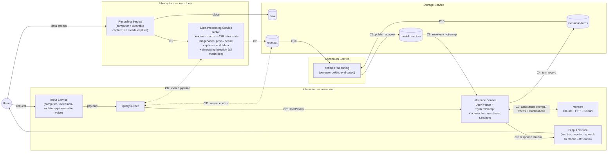

# Nucleus v0 — High-Level Architecture

> The stable system-design doc and the **home of the inter-service contracts**. Service
> internals live in each `services/<key>/CHARTER.md`; this file owns the seams between them.
> This is an evolving first version, not a frozen spec — changes to §Contracts route through
> a founders' session and a note in [HANDOFF.md](HANDOFF.md).

**Last updated:** 2026-07-08

---

## The two loops

Everything in v0 is one of two loops sharing the same stores and the same per-user model:

- **Serve loop (interactive, seconds):** user asks → request is normalized and templated →
  the personal model (+ harness + mentors) answers → response is delivered; the turn is stored.
- **Learn loop (background, nightly-ish):** life stream is captured → processed into
  timestamped, enriched records → stored → periodically fine-tuned into the user's adapter →
  published for serving. The context of a day silently becomes weights overnight.

The serve loop makes the product usable today; the learn loop is why it exists.

## System diagram

## Components

| Component | One-liner | Charter |
|---|---|---|
| Recording Service | Captures the user's physical + digital life and lands it on our backend; privacy front line (consent controls) | [charter](services/recording/CHARTER.md) |
| Data Processing Service | Raw streams → structured, timestamped, world-enriched records; same pipeline serves interactive requests via C8 | [charter](services/data-processing/CHARTER.md) |
| Storage Service | All durable stores — `/raw`, `/context`, `/sessions`, model directory; time/user indexing, isolation, encryption, deletion primitives | [charter](services/storage/CHARTER.md) |
| Input Service | Chat surfaces + the QueryBuilder that turns a raw multimodal payload into a model-ready UserPrompt | [charter](services/input/CHARTER.md) |
| Inference Service | The brain: vLLM + per-user LoRA hot-swap, agentic harness, mentor protocol, turn logging | [charter](services/inference/CHARTER.md) |
| Output Service | Delivers responses to the right device in the right form; future home of the proactive channel | [charter](services/output/CHARTER.md) |
| Continuum Service | The magic: nightly per-user fine-tuning with replay mixtures and eval gates; publishes adapters | [charter](services/continuum/CHARTER.md) |
| Platform Service | Cross-cutting: infra, CI/CD, observability, security/privacy/compliance, cost. **Added beyond the original HLD — pending CTO ratification** | [charter](services/platform/CHARTER.md) |

## Contracts (the spine)

The only coupling between services. Parallel sessions may build freely as long as these hold;
**changing one means editing THIS section first**, then notifying both owning services (rows
in their HANDOFF.md). Payload details get pinned by the owning pairs as they build (M0/M1);
what is locked now is direction, ownership, and shape.

| ID | Producer → Consumer | Carries | Notes |
|---|---|---|---|
| **C1** | recording → data-processing | Raw stream envelope: `user_id`, `device_id`, `stream_id`, `sequence`, `chunk_id`, modality, codec, wall-clock `t_start/t_end`, blob ref (+ sha256/bytes), optional device location/clock | **v0 frozen (learn-loop, below).** One envelope format for all four modalities; blobs land in storage `/raw` first, the envelope carries the ref; push/at-least-once, dedup on `chunk_id`, gaps via `(stream_id, sequence)`; location populated where the device has it, else data-processing infers from content |
| **C2** | data-processing → storage `/context` | Processed record: timestamps, transcript/caption content, enrichments (speakers, known faces, geo/place tags, objects), raw ref, pipeline version | **v0 frozen (learn-loop, below).** Timestamp spine: concurrent activities from different devices must be alignable |
| **C3** | input (QueryBuilder) → inference | **UserPrompt**: chat-templated multimodal request + session/turn ids + client capabilities | The seam where "user request" becomes "model input"; a *clarification-answer* variant binds a reply to a pending turn (see C7/C9) |
| **C4** | inference → storage `/sessions` | Turn record incl. **full mentor traces + tool traces** | Traces are continuum's training data — never truncate |
| **C5** | continuum → model directory | Adapter version entry: `user_id`, version, base-model hash, training window, eval report, status (active/rolled-back) | Publish is eval-gated; rollback is first-class |
| **C6** | model directory ↔ inference | `resolve(user_id)` → latest eligible adapter; hot-swap in vLLM per request | Same mechanism during fine-tuning windows |
| **C7** | inference ↔ mentors | Assistance prompt out (system + user + user-context injection); thinking/plan/response traces back; **clarification-question relay** through our model to the user and back | Mentor traces route into C4 |
| **C8** | QueryBuilder ↔ data-processing | The stream pipeline exposed as a **synchronous API** | Interactive requests get identical normalization to the life stream — one pipeline, two entry points |
| **C9** | inference → output | Grounded **response-stream envelope**: token/text stream, mid-turn frames (mentor clarification questions, status), end-of-turn metadata | The only serve-loop hop after C4; mid-turn clarification frames are C7's user-facing leg — answers return as the C3 clarification-answer variant |
| **C10** | storage → continuum | **Training-window read**: time-ranged, watermarked export of `/context` + `/sessions` per user | Watermark semantics (late-arriving / reprocessed records, pipeline-version bumps) are pinned here |
| **C11** | storage → input (QueryBuilder) | **Recent-context read**: recency/semantic retrieval over `/context` + `/sessions` for same-day grounding | Bridges the gap before the nightly cycle lands in weights; the index lives in storage, QueryBuilder decides what enters the UserPrompt |

### Frozen MVP shapes — serve-loop v0.0 (2026-07-09)

The **minimal, text-only** shapes the serve-loop MVP builds against. Machine-readable JSON
Schemas are the source of truth in [`contracts/`](contracts/); the prose here is the summary.
**Versioning:** these are `version: "0"`. They *will* grow (more modalities, mid-turn frames,
adapters) — additive fields are fine without ceremony; any **breaking** change bumps the version
and updates the schema file + this section. The **serve-loop** v0.0 slice exercises C3, C9, C4, C6
(below); the **learn-loop** v0.0 slice adds C1, C2 (further below). C5/C7/C8/C10/C11 are not
touched until their slices.

- **C3 UserPrompt v0** (`contracts/c3_userprompt.v0.json`): `{contract:"C3", version:"0",
  user_id, session_id, turn_id, created_at, messages:[{role:"user"|"system", text}],
  client_capabilities:{surface, modalities:["text"], can_render_markdown}, template_version}`.
  MVP: one user message; inference prepends the system prompt.
- **C9 Response stream v0** (`contracts/c9_response_stream.v0.json`): an HTTP streamed body —
  answer **text chunks**, then a single `\x1e` (U+001E) separator, then one JSON **end frame**
  `{turn_id, model_id, adapter:"base", usage:{prompt_tokens, output_tokens}, finished:true}`.
  Errors: an end frame with `{error:"..."}`. Mid-turn frames are **reserved, not emitted** in v0.
- **C4 Turn record v0** (`contracts/c4_turn_record.v0.json`): `{contract:"C4", version:"0",
  user_id, session_id, turn_id, user_prompt:<C3>, response_text, model_id, adapter:"base",
  created_at, completed_at, tool_traces:[], mentor_traces:[]}`. Trace arrays are empty in v0
  (no harness/mentors yet) but present so the shape never changes when they arrive.
- **C6 resolve v0** (`contracts/c6_resolve.v0.json`): `GET resolve?user_id=…` →
  `{model_id:"Qwen/Qwen3-VL-32B-Instruct", adapter:"base", adapter_path:null}`. Trivial until
  continuum ships per-user adapters.

### Frozen MVP shapes — learn-loop v0.0 (2026-07-09)

The **minimal, audio-only** shapes the learn-loop (capture) MVP builds against — the barebones
path **computer mic → ASR → `/context`**. Machine-readable JSON Schemas are the source of truth
in [`contracts/`](contracts/); the prose here is the summary. Same versioning rule as the
serve-loop block: `version:"0"`, additive fields free, breaking changes bump the version + edit the
schema file + this section. v0.0 exercises **one device+modality** (computer mic, `audio`); the
shapes carry all four modalities so the vision/text pipelines add records without a reshape.

- **C1 Raw-stream envelope v0** (`contracts/c1_raw_stream_envelope.v0.json`) — C1 has **two legs**:
  - **Blob leg (recording → storage `/raw`):** recording `PUT`s the raw chunk bytes to storage
    `/raw` **first**; storage mints an **opaque `blob_ref`** (idempotent on `chunk_id`). Only
    storage resolves the ref; data-processing pulls the bytes by ref for ASR. Pinned as prose here
    (like C9's wire format), **not** a separate C-number.
  - **Envelope leg (recording → data-processing):** `{contract:"C1", version:"0", user_id,
    device_id, stream_id, sequence, chunk_id, modality, codec, t_start, t_end, blob_ref,
    blob_sha256, blob_bytes, device_location?, device_clock?}`.
  - **Delivery semantics (frozen):** **push, at-least-once**; consumers idempotent on **`chunk_id`**
    (the dedup key — a client-minted ULID, stable across retries); ordering + gap detection via
    **`(stream_id, sequence)`**, where `sequence` is **dense, zero-based, +1 per chunk** within a
    **globally-unique** `stream_id` (any break — including a non-zero first-seen value — is a lost
    chunk → "zero silent loss"); **blob-first** write invariant (blob durable in `/raw` before the
    envelope is emitted, so `blob_ref` does not dangle at emit — consumers still tolerate a
    since-deleted blob, since `/raw` deletion + re-pull-by-ref both exist).
- **C2 Processed record v0** (`contracts/c2_processed_record.v0.json`): `{contract:"C2",
  version:"0", record_id, user_id, source:{device_id, stream_id, chunk_id, blob_ref, modality},
  t_start, t_end, content:{kind:"transcript", text, language?, segments?:[{t_start, t_end, text,
  speaker}]}, enrichments:{speakers:[], faces:[], places:[], objects:[]}, pipeline_version,
  processed_at}`. `record_id` is a **deterministic function of `(chunk_id, pipeline_version)`** — so
  reprocessing is an idempotent `/context` upsert and a `pipeline_version` bump forks a new record
  (version-forward). `enrichments` is **present-but-empty** in v0 (mirrors C4's empty trace arrays)
  so diarization / world-data never reshape it. Storage assigns `ingest_time` + user-local tz —
  **not** carried in C2.

## Ownership splits (pinned — cross-referenced from the charters)

Where a responsibility naturally touches several services, the split is decided **here**, once:

| Concern | Split |
|---|---|
| **Wearable device** | **Camera + mic only — no speaker** (current bodycam market has none). Recording owns the device pick + capture firmware; input owns the on-device interaction UX (push-to-talk). |
| **Mobile app (v0 surface)** | A first-class v0 client that **does not capture** (no screen recording). Input owns it as an interaction chat surface; output uses it as the **speech-output sink**. Only *mobile screen capture* is deferred (§Decisions), not the app. |
| **Speech output routing** | The wearable has no speaker, so synthesized speech is delivered to the **mobile app**, which plays it to connected headphones/earbuds (Bluetooth audio). Output owns delivery + routing; mobile is the default speech sink until a speaker-equipped wearable exists. |
| **Durable data custody** | ALL durable stores live in storage — `/raw` (blobs recording writes via ingest), `/context`, `/sessions`, model directory. No service keeps its own durable user data. |
| **Deletion (right-to-be-forgotten)** | Storage owns per-store delete primitives (incl. `/raw` and adapter artifacts). Platform owns the cross-store orchestration + proof-of-deletion, calling storage/continuum primitives. Deletion-vs-trained-weights: v0 default is full retrain from retained records; final policy is an open research question (continuum × platform). |
| **Consent** | Platform owns consent policy + the consent-record store and gate ("no consent record ⇒ no ingest"). Recording owns on-device enforcement (pause / mute / delete-last-N, capture indicators). Bystander-consent policy is decided by platform, enforced by recording. |
| **BWM (base world model)** | The pick is recorded in §Decisions below. Inference owns artifact custody + serving. Continuum pins the base-model hash per adapter (C5) and executes upgrade migrations (fleet retrain) — upgrades are explicit, never hot. |
| **People/known-faces registry** | Data-processing owns matching/enrichment; storage persists the registry; input owns the curation + consent UX surface. Voice-to-person linking (known-vs-unknown *speakers*) rides the same registry — deferred-vs-v0 is data-processing's call, recorded in its charter. |
| **Same-day context** | Weights only know up to the last nightly cycle. The recent-context read path (C11) is owned by input's QueryBuilder; the recency/semantic index behind it lives in storage. |
| **Observability** | **Every service exposes a `/metrics` endpoint and ships its Grafana dashboard JSON** (per-service ownership). Platform runs the ONE shared Prometheus + Grafana + standard exporters and provisions those dashboards. See §Observability. |

## Observability (cross-cutting requirement — every service)

Decided 2026-07-09 (D9). Observability is a **standing obligation on every service**, not an
add-on: an always-on system needs both founders to open one place and see any service's health.

- **Each service exposes `/metrics`** (Prometheus text format) on its own port. Baseline every
  service emits: **request rate, request-latency histogram, error rate** (the FastAPI services
  get these from `prometheus-fastapi-instrumentator`; non-HTTP work emits equivalent counters).
  Service-specific additions: **inference → GPU** (via dcgm-exporter), **storage → DB/query**
  metrics, **data-processing → pipeline throughput/queue depth**, **recording → ingest rate +
  capture-health**, **continuum → training-job + eval-gate** metrics.
- **Each service owns a Grafana dashboard JSON** in its repo (`services/<key>/dashboards/*.json`)
  — the service knows what's worth showing.
- **Platform runs ONE shared Prometheus + Grafana** (pinned port, see [STACK.md](STACK.md)),
  scrapes all `/metrics`, runs the standard exporters (node/CPU, dcgm/GPU, DB), routes alerts,
  and **auto-provisions** each service's dashboard JSON. Both founders use a single Grafana URL
  and pick any service.
- **Build split:** service agents instrument (`/metrics` + dashboard JSON); Platform builds the
  backbone (Prometheus/Grafana/exporters/provisioning). This is the *design pattern*, not an
  inter-service payload — it is **not** a C-series contract; it is a convention pinned here +ports
  in [STACK.md](STACK.md).
- **Scope note (CTO):** node/CPU/host graphs are **placeholders** until the true multi-node
  microservice split (today everything shares one box). The metrics that mean something *now* are
  **app latency, error rate, and GPU** (inference). We wire the plumbing anyway so the graphs
  light up for free when services spread across nodes.

## Request walkthrough (serve loop)

1. User speaks/types/snaps via a surface (Input Service) → payload envelope.
2. QueryBuilder normalizes the payload through data-processing (C8) and assembles the
   UserPrompt (C3).
2b. QueryBuilder may also pull same-day grounding via the recent-context read (C11).
3. Inference resolves the user's latest adapter (C6), builds system + user prompt, runs the
   agentic harness (tools, sandbox). If the model wants help it fires the mentor protocol
   (C7); mentor clarification questions relay to the user as C9 mid-turn frames, and the
   user's answers return as C3 clarification-answer variants.
4. Grounded response streams to the Output Service (C9) → device. Turn (with all traces) → C4.

## Day walkthrough (learn loop)

1. All day: wearable + computer stream via C1; data-processing denoises/diarizes/transcribes/
   captions, injects timestamps, enriches with world data (known faces, geolocation, place
   tags); records land in `/context` (C2).
2. Nightly: continuum pulls the cycle window via the training-window read (C10) and curates
   the day's `/context` + `/sessions` (incl. mentor traces) into a
   training mixture with anti-forgetting replay, trains the user's LoRA, runs eval gates
   (personal recall + general-capability forgetting), publishes or rolls back (C5).
3. Morning: inference resolves the new adapter (C6). The model knows yesterday.

## Decisions (locked for v0)

| Area | Decision | Source |
|---|---|---|
| Base model (BWM) | **Qwen3-VL-32B** (open, dense; already served on vLLM TP=8 in poc/live_video_chat, so the serving path is proven). The older chunk-sweep's OCR dip is **not a blocker**: OCR is handled upstream by a specialist pass in data-processing (below), not by the BWM reading pixels at inference | user (CTO) |
| On-screen text (OCR) | **Decouple OCR from the base model.** A dedicated OCR-strong VLM transcribes legible text + frame location in the data-processing pipeline; that text is woven into the description written to `/context` (and returned via C8 → `/sessions`). The user model learns text from the *description target*, so BWM OCR quality never gates the product. Owner: [data-processing](services/data-processing/CHARTER.md) | user (CTO) |
| Personalization | **LoRA per user, all layers**; MoE-experts-per-user is the research path, not v0 | start.md |
| Serving | **vLLM** with adapter hot-swap on request boundaries, during fine-tuning too | start.md |
| Learning cadence | Periodic (nightly-ish), **eval-gated** before publish — never trained live into serving | start.md + POC forgetting results |
| Devices | **Capture:** computer (screen / extension / mic) + wearable body cam (camera + mic, **no speaker**). **Interaction + speech-out:** computer, wearable push-to-talk, and a **v0 mobile app**. Only *mobile screen capture* is deferred (iOS restriction) — the mobile app itself ships in v0 | start.md + CTO |
| Build order | **Serve-loop first** — stand up the thin end-to-end backbone (input → QueryBuilder → inference on the base model → output) as the walking skeleton, then grow capture, storage depth, and continuum around it | CTO |
| Code provenance | **POCs are reference, not source.** Production is written fresh; the `poc/` work informs contracts, learnings, and de-risking only — no lift-and-shift of POC code | CTO |
| Mentors | Frontier APIs (Claude, GPT, Gemini); full traces logged as training data | start.md |
| Scale posture | Handful of pilot users; per-user LoRA swap is acceptable at this scale | start.md |
| Privacy | Consent controls on-device, per-user isolation, encryption, executable deletion — day-one requirements | founders |

## Known evolution paths (not v0)

- **LoRA → MoE-users**: experts allocated per user, routing by identity; continuum owns the research.
- **Mobile screen capture** when platform restrictions allow (the mobile *app* already ships in v0 for interaction + speech output; only capture is deferred).
- **Speaker-equipped wearable** — folds the speech-output sink back onto the device; until then mobile → Bluetooth audio carries it.
- **Proactive channel**: notifications → nudges → coach mode (output service's future).
- **Realtime-ish learning**: shrinking the nightly cycle as stability research matures.
- **Deletion vs weights**: right-to-be-forgotten for data already distilled into adapters —
  open research + policy question (platform × continuum).
