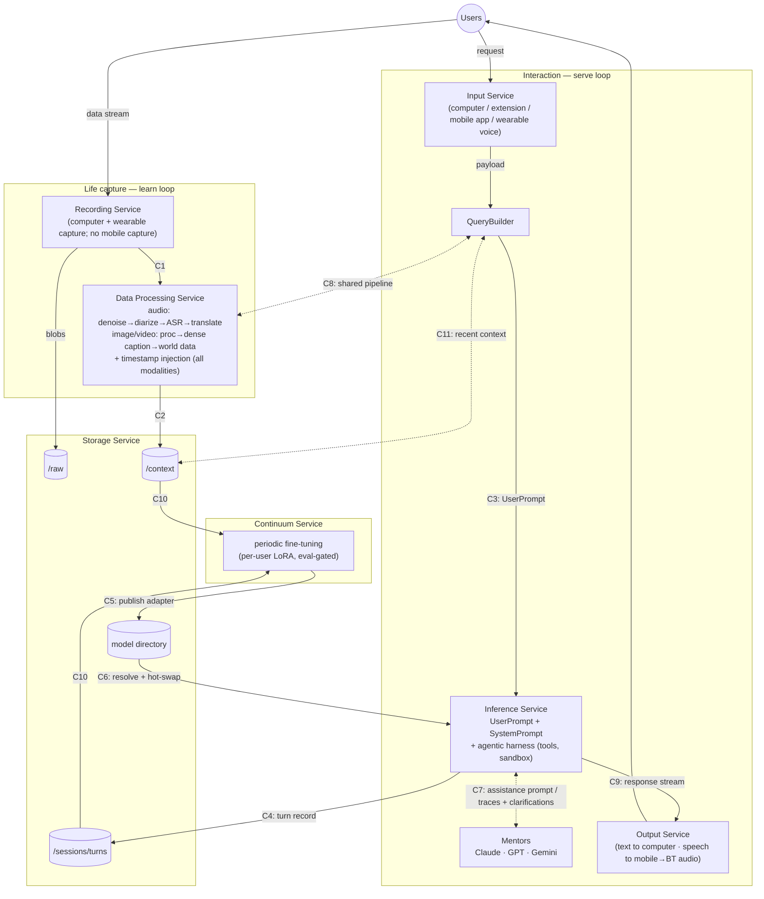

# Nucleus v0 — High-Level Architecture

> The stable system-design doc and the **home of the inter-service contracts**. Service
> internals live in each `services/<key>/CHARTER.md`; this file owns the seams between them.
> This is an evolving first version, not a frozen spec — changes to §Contracts route through
> a founders' session and a note in [HANDOFF.md](HANDOFF.md).

**Last updated:** 2026-07-28 (§Contracts restructured into per-contract cards, per [STYLE.md](STYLE.md))

---

## Stage: PROTOTYPE (pre-dev, pre-production)

Every document in this repo is written in a production voice. That
voice is aspirational, and reading it as a commitment is the single most expensive mistake a new
session can make here. **We are building a prototype: the goal is one end-to-end product that
genuinely works, as fast as we can honestly get there.**

**What this licenses.** Contracts may be **re-cut rather than versioned**: a pinned shape is
"stable enough to build against today", never "immutable", which is why §Contracts does not use the
word *frozen* at all. Stored data may be wiped and re-collected rather than migrated; everything
captured so far is experiment output, not user data. Durability work (Postgres/GCS, retention
sweeps, backup drills, multi-node) is deferred on purpose, with the reason written down.

**What it does not license**, because this is the half that keeps the posture honest:
- Skipping [ORG.md](ORG.md)'s contract-edit order. A re-cut contract still edits §Contracts first,
  then `contracts/`, then **both** owning canvases. Cheap to change is not the same as unowned.
- Undocumented decisions. "Prototype" defers work; it never leaves a choice unrecorded. The
  deferral itself is the thing that must be written down, or it is just a gap.
- Silent breakage. A thing we know is wrong stays wrong on the record, not quietly.
- **Claiming something is built when it is decided.** The stage changes what we build, never what
  we say about it.

**What changes at dev/prod.** Everything parked under this banner is tracked, not forgotten. Every
parked action-item is picked up before we serve a general audience at scale.

## The two loops

Everything in v0 is one of two loops sharing the same stores and the same per-user model:

- **Learn loop (background, nightly-ish):** life stream is captured → processed into timestamped,
  enriched records → stored → fine-tuned into the user's adapter → published for serving.
  The context of a day silently becomes weights overnight.
- **Serve loop (interactive, seconds):** user asks → request is normalized and templated →
  the personal model (+ harness + mentors) answers → response is delivered; the turn is stored.

> **The serve loop makes the product usable today; the learn loop is why it exists.**

## System High-Level Diagram


```mermaid
flowchart TD
  U((Users))

  subgraph capture [Life capture — learn loop]
    RS["Recording Service<br/>(computer + wearable capture; no mobile capture)"]
    DPS["Data Processing Service<br/>audio: denoise→diarize→ASR→translate<br/>image/video: proc→dense caption→world data<br/>+ timestamp injection (all modalities)"]
  end

  subgraph interact [Interaction — serve loop]
    IS["Input Service<br/>(computer / extension / mobile app / wearable voice)"]
    QB[QueryBuilder]
    INF["Inference Service<br/>UserPrompt + SystemPrompt<br/>+ agentic harness (tools, sandbox)"]
    MEN["Mentors<br/>Claude · GPT · Gemini"]
    OS["Output Service<br/>(text to computer · speech to mobile→BT audio)"]
  end

  subgraph data [Storage Service]
    RAW[("/raw")]
    CTX[("/context")]
    SES[("/sessions/turns")]
    MD[("model directory")]
  end

  subgraph learn [Continuum Service]
    FT["periodic fine-tuning<br/>(per-user LoRA, eval-gated)"]
  end

  U -- data stream --> RS -- C1 --> DPS -- C2 --> CTX
  RS -- blobs --> RAW
  U -- request --> IS -- payload --> QB -- C3: UserPrompt --> INF
  QB <-. C8: shared pipeline .-> DPS
  QB <-. C11: recent context .-> CTX
  INF -- C4: turn record --> SES
  INF <-. "C7: assistance prompt / traces + clarifications" .-> MEN
  INF -- C9: response stream --> OS --> U
  CTX -- C10 --> FT
  SES -- C10 --> FT
  FT -- C5: publish adapter --> MD
  MD -- C6: resolve + hot-swap --> INF
```

## Components

| Component | One-liner | Charter |
|---|---|---|
| Recording Service | Captures the user's physical + digital life and lands it on our backend | [charter](services/recording/CHARTER.md) |
| Data Processing Service | Raw streams → structured, timestamped, world-enriched records; same pipeline serves interactive requests via C8 (serve-loop) | [charter](services/data-processing/CHARTER.md) |
| Storage Service | All durable stores — `/raw`, `/context`, `/sessions`, model directory; time/user indexing, isolation, encryption, deletion primitives | [charter](services/storage/CHARTER.md) |
| Input Service | Chat surfaces + the QueryBuilder that turns a raw multimodal payload into a model-ready UserPrompt | [charter](services/input/CHARTER.md) |
| Inference Service | The brain: vLLM + per-user LoRA hot-swap, agentic harness, mentor protocol, turn logging | [charter](services/inference/CHARTER.md) |
| Output Service | Delivers responses to the right device in the right form; future home of the proactive channel | [charter](services/output/CHARTER.md) |
| Continuum Service | The magic: nightly per-user fine-tuning with replay mixtures and eval gates; publishes adapters | [charter](services/continuum/CHARTER.md) |
| Platform Service | Cross-cutting: infra, CI/CD, observability, security/privacy/compliance, cost. An umbrella service ([D1](DECISIONS.md)) | [charter](services/platform/CHARTER.md) |

## Contracts (the spine)

The only coupling between services. Parallel sessions may build freely as long as these hold, and
**changing one means editing this section first**, then [`contracts/`](contracts/), then both owning
services' canvases ([ORG.md](ORG.md) §Documentation protocol).

Every contract has a **card** below the index: what it carries, the wire shape, the rules a builder
must honour, why it is shaped that way, the traps, and how it got here. Cards follow
[STYLE.md](STYLE.md) — extend one by adding to a section, never by growing a table cell.

**Versioning.** Bodies are `version:"0"` (C10 is `"1"` — it evolved in place). The machine-readable
JSON Schemas in [`contracts/`](contracts/) are the source of truth; the shapes here are the summary.
Additive optional fields need no ceremony. A **breaking** change bumps the version, writes a new
`*.vN.json`, and edits the card. C5, C7, C8 and C11 get schema files when their slices start.

**Status** is one of `designed` (pinned on paper, no code) or `built` (running in code). We do
**not** use the word *frozen* while the stage is PROTOTYPE ([D19](DECISIONS.md)): it promises an
immutability the stage explicitly withholds, and an agent who believes it will circle a contract
looking for a workaround instead of proposing the two-line edit that fixes the problem. The real
signal is the **schema link** on a card's status line — it means code validates against that shape,
so breaking it fails CI. The word comes back at production stage.

### Vocabulary

Terms this repo coined. Nobody arrives knowing them.

| Term | Means |
|---|---|
| **envelope** | The metadata describing a captured chunk: who, which device and stream, when, and where the bytes live. |
| **chunk** | A few seconds of captured stream. The unit of dedup, via `chunk_id`. |
| **`/context`** | The durable store of processed records — what was said, seen and read, timestamped. |
| **record** | One processed unit in `/context`: a transcript, a caption, an OCR pass. |
| **dialect** | *Which processing produced this text.* The trainer must see only one dialect per unit. |
| **discriminator** | What tells a chunk's several records apart — an `ocr` beside a `caption`. `""` when there is only one. |
| **window** | The span one night's training covers: `[last_trained_t, now−δ)` on storage's ingest axis. |
| **watermark** | `last_trained_t` — how far this user's adapter has actually been trained. Moves only on a publish. |
| **day-log** | The rendered account of a window that the trainer reads: anchored scene blocks. |
| **segment** | A ~10 s bucket of a day-log, holding whatever captions, transcripts and OCR fell inside it. |
| **block** | A run of adjacent segments rendered as one passage. Its `text` *is* the training corpus. |
| **anchor** | A block's opening local-time line — *"On [Tuesday], around 09:00–09:20 local time…"*. |
| **amplification** | Rewriting a day-log into many training variants, so one day yields enough signal. |
| **reservoir** | The append-only store of those amplified corpora. Audit and provenance, not the replay path. |
| **replay** | Mixing prior days into tonight's run, so learning today does not erase yesterday. |
| **eval gate** | The check an adapter must pass — recall up, general capability not down — before it may serve. |
| **adapter** | The per-user LoRA weights that make the shared base model *this user's* model. |
| **cycle** | One night end to end: open window → day-log → amplify → train → gate → publish or roll back. |
| **parity** | Proof that a rewritten component is byte-identical to the research line it replaced. |

### The index

| ID | Producer → Consumer | Carries | Status | Card |
|---|---|---|---|---|
| **C1** | recording → data-processing | Every captured chunk's metadata, and where its bytes landed | `built` | [↓](#c1--the-raw-stream-envelope) |
| **C2** | data-processing → storage `/context` | One processed record: what was said, seen or read, and when | `built` | [↓](#c2--the-processed-record) |
| **C3** | input (QueryBuilder) → inference | A user's request, turned into model input | `built` | [↓](#c3--the-userprompt) |
| **C4** | inference → storage `/sessions` | The full record of one turn, traces included | `built` | [↓](#c4--the-turn-record) |
| **C5** | continuum → model directory | A newly trained adapter, and whether it may serve | `built` | [↓](#c5--the-adapter-publish) |
| **C6** | model directory ↔ inference | Which adapter to load for this user, right now | `built` | [↓](#c6--adapter-resolution) |
| **C7** | inference ↔ mentors | Questions to frontier models, and everything they answer with | `designed` | [↓](#c7--the-mentor-protocol) |
| **C8** | QueryBuilder ↔ data-processing | The capture pipeline, offered synchronously to a live request | `designed` | [↓](#c8--the-shared-pipeline-api) |
| **C9** | inference → output | The answer, streaming, and what happened at the end of the turn | `built` | [↓](#c9--the-response-stream) |
| **C10** | storage → continuum | Tonight's training window, and the day-log rendered over it | `built` | [↓](#c10--the-training-window-read) |
| **C11** | storage → input (QueryBuilder) | What the user did today, before tonight's training reaches the weights | `designed` | [↓](#c11--the-recent-context-read) |
| **C12** | storage → continuum | Per-user policy the system reads to decide its own behaviour | `built` | [↓](#c12--the-user-profile-read) |
| **C13** | storage → continuum + inference | Versioned recipes and gate policies, fetched by id | `built` | [↓](#c13--the-recipe-registry) |
| **C14** | continuum ↔ storage | A night's amplified corpus, and the ledger recording it | `built` | [↓](#c14--the-reservoir) |

### C1 — the raw-stream envelope

> **recording → data-processing** (plus a blob leg to storage `/raw`) · `built` · learn-loop v0.0
> · [D10](DECISIONS.md) · [D11](DECISIONS.md) · [D17](DECISIONS.md)
> · schema [c1_raw_stream_envelope.v0.json](contracts/c1_raw_stream_envelope.v0.json)

**In one line.** Recording tells data-processing *"here are a few seconds of this user's life, and
here is where I put the bytes."*

**Shape** — two legs.

```
Blob leg      recording ──PUT bytes──▶ storage /raw
                                       storage mints an opaque blob_ref, idempotent on chunk_id

Envelope leg  recording ──push──▶ data-processing
{contract:"C1", version:"0", user_id, device_id, stream_id, sequence, chunk_id,
 modality, codec, t_start, t_end, blob_ref, blob_sha256, blob_bytes,
 device_tz?, device_utc_offset_minutes?, device_location?, device_clock?}
```

**Rules**

- One envelope format serves all four modalities, so the vision and text pipelines never reshape the
  wire.
- **Blob first.** The bytes are durable in `/raw` before the envelope is emitted, so `blob_ref`
  cannot dangle at emit. Consumers still tolerate a since-deleted blob — `/raw` deletion is a feature.
- Delivery is **push, at-least-once.** Consumers are idempotent on **`chunk_id`**, a client-minted
  ULID that is stable across retries.
- `sequence` is **dense, zero-based, +1 per chunk** inside a globally-unique `stream_id`. Any break —
  including a non-zero first-seen value — is a lost chunk. This is the "zero silent loss" mechanism.
- `t_start`/`t_end` are the canonical **instant**, RFC3339 UTC.
- The capturing device reports **`device_tz`** (IANA zone id) and **`device_utc_offset_minutes`**,
  both optional-additive. A client that omits them degrades to the user's profile `home_tz` (C12).
- Only storage resolves a `blob_ref`. Data-processing pulls the bytes by ref.

**Why it's this way**

- **The capturing device is the only thing that knows where the user was.** Every client already
  computes the local instant and converts it to UTC, discarding the zone on the same line. UTC alone
  answers "the last 24 h"; it cannot answer "the user's Tuesday, 09:00–17:00", nor render an honest
  local anchor line.
- **The offset rides along with the zone** because it is not merely derivable from it. It is the
  independent witness when a device's tzdata is stale or wrong.
- **The blob leg is pinned as prose rather than given its own C-number.** It is one service writing
  to one store, not a seam between two designs — the same treatment C9's wire format gets.

**Watch out for**

- **Never an abbreviation.** `PST` and `MST` are ambiguous and DST-sensitive. IANA ids only, rejected
  400 at the capture edge.
- **`blob_ref` is opaque.** Do not parse it or infer a path from it.

**How it got here**

- **2026-07-26 — D17: the device started reporting its own zone.**
  - **Was** — every client discarded the zone at capture, so nothing downstream could answer a
    civil-time question or write an honest local anchor.
  - **Changed** — added `device_tz` and `device_utc_offset_minutes` to the envelope,
    optional-additive.
  - **Now** — the zone travels with the chunk; a client that omits it falls back to `home_tz`.
  - **Payoff** — no version bump, and the design is correct under travel by construction.
- **2026-07-09 — D11: two legs, and push delivery.**
  - **Was** — the ingest path was an open question in both the recording and data-processing
    charters.
  - **Changed** — split C1 into a blob leg and an envelope leg, and pinned delivery semantics as part
    of the contract rather than leaving them to implementations.
  - **Now** — blob-first, push, at-least-once, dedup on `chunk_id`, gaps via `(stream_id, sequence)`.
  - **Payoff** — loss becomes detectable rather than merely unlikely, which is the property the
    capture path is built around.

### C2 — the processed record

> **data-processing → storage `/context`** · `built` · learn-loop v0.0
> · [D10](DECISIONS.md) · [D17](DECISIONS.md) · [D19](DECISIONS.md)
> · schema [c2_processed_record.v0.json](contracts/c2_processed_record.v0.json)

**In one line.** Data-processing writes down what a chunk actually contained — the words spoken, the
scene described, the text on screen — with the timestamps that let separate devices be lined up
against each other.

**Shape**

```
{contract:"C2", version:"0", record_id, user_id,
 source:{device_id, stream_id, chunk_id, blob_ref, modality,
         device_tz?, device_utc_offset_minutes?, device_location?},
 t_start, t_end,
 content:{kind:"transcript", text, language?,
          segments?:[{t_start, t_end, text, speaker}]},
 enrichments:{speakers:[], faces:[], places:[], objects:[]},
 pipeline_version, discriminator?, processed_at}
```

**Rules**

- `record_id` is a **deterministic function of `(chunk_id, pipeline_version, discriminator)`**, so
  reprocessing is an idempotent `/context` upsert.
- A `pipeline_version` bump **forks** a new record rather than rewriting the old one. Reprocessing is
  version-forward; records are never edited in place.
- The **discriminator** keeps a chunk's several records distinct and individually stable — video
  keyframes, an `ocr` record beside a `caption`, an original beside its translation. It is `""` in
  the 1:1 case.
- `enrichments` is **present-but-empty** in v0, so diarization and world data never reshape the
  record when they land.
- `source.device_tz`, `source.device_utc_offset_minutes` and `source.device_location` are carried
  **verbatim** from the C1 envelope. Data-processing performs **no timezone logic whatsoever** — it
  does not derive, validate, normalize or infer a zone.
- `t_start`/`t_end` stay UTC-canonical and are the sole ordering and range-query axis. The zone is
  context stored *beside* the instant, never instead of it.
- Storage assigns `ingest_time`. It is **not** carried in C2.

**Why it's this way**

- **Timestamps are the spine.** Concurrent activity captured by different devices has to be
  alignable, which is what makes a day-log possible at all.
- **The empty `enrichments` block is deliberate**, mirroring C4's empty trace arrays: shipping the
  shape before the content means the contract does not move when the content arrives.
- **Forwarding provenance is not producing a signal.** Because data-processing only copies the zone
  fields, they fall outside the record-emission law's T2 "reachable consumer" test, which governs
  signals DP *produces*.

**Watch out for**

- **Mirrors must move with the schema.** DP's `C2Source` and storage's `Source` are `extra="forbid"`
  — the trap D17 hit. A field added to the schema but not to both mirrors fails closed.
- A record whose chunk carried no zone simply omits those fields. Absence is normal, not an error.

**How it got here**

- **2026-07-27 — D19: the `discriminator` was surfaced.**
  - **Was** — the discriminator had fed `record_id` since v0 but lived *only* inside the hash, so a
    reader holding two records could not tell whether they were two units of one chunk or two
    dialects of one unit. C10's one-dialect rule needs exactly that distinction.
  - **Changed** — emitted it as a top-level optional string, absent or `""` in the 1:1 case.
  - **Now** — the invariant is visible. Duplicate discriminators within a chunk were already rejected
    at `services/data-processing/app/stagegraph/executor.py:396-401`, so this added no new promise.
  - **Payoff** — nothing re-keyed: `record_id` is unchanged, and an empty discriminator still
    reproduces the two-component v0 id byte-for-byte (`app/pipeline.py:33-46`).
- **2026-07-26 — D17: civil-time passthrough.**
  - **Was** — four documents promised a *storage-assigned* user-local timezone that was never built.
  - **Changed** — the zone comes from the capturing device instead, carried verbatim from C1.
  - **Now** — `source.device_tz` and `source.device_utc_offset_minutes` ride along, optional-additive.
  - **Payoff** — correct under travel by construction, because the device reports where the user
    actually was.
- **2026-07-26 — the prose caught up with its own schema.**
  - **Was** — this summary described `record_id` as deterministic on `(chunk_id, pipeline_version)`,
    while the schema had mandated the discriminator since v0.
  - **Changed** — corrected the summary.
  - **Now** — schema and prose agree.
  - **Payoff** — explicitly **not** a contract change. The authoritative artifact was right all
    along and only its summary lagged, which is a shape of defect [ORG.md](ORG.md) names because it
    recurs.
- **2026-07-09 — D10: minted with the learn-loop skeleton.** ASR only — transcript plus segment
  timestamps, no diarization, no enrichment, no vision.

### C3 — the UserPrompt

> **input (QueryBuilder) → inference** · `built` · serve-loop v0.0
> · schema [c3_userprompt.v0.json](contracts/c3_userprompt.v0.json)

**In one line.** The seam where a user's request stops being a payload and becomes model input.

**Shape**

```
{contract:"C3", version:"0", user_id, session_id, turn_id, created_at,
 messages:[{role:"user"|"system", text}],
 client_capabilities:{surface, modalities:["text"], can_render_markdown},
 template_version}
```

**Rules**

- v0 carries one user message; inference prepends the system prompt.
- A **clarification-answer variant** binds a reply to a pending turn — the return leg of a mentor
  question relayed out through C9.

### C4 — the turn record

> **inference → storage `/sessions`** · `built` · serve-loop v0.0
> · schema [c4_turn_record.v0.json](contracts/c4_turn_record.v0.json)

**In one line.** Everything that happened during one turn, written down — including every word
exchanged with the mentors.

**Shape**

```
{contract:"C4", version:"0", user_id, session_id, turn_id, user_prompt:<C3>,
 response_text, model_id, adapter:"base", created_at, completed_at,
 tool_traces:[], mentor_traces:[]}
```

**Rules**

- **Never truncate the traces.** They are continuum's training data.
- Trace arrays are empty in v0 — no harness and no mentors yet — but present, so the shape does not
  change when they arrive.

### C5 — the adapter publish

> **continuum → model directory** · `built` · no schema file yet
> · the shape is deliberately not pinned ([D19](DECISIONS.md))

**In one line.** Continuum records that a new adapter exists for a user, and whether it is allowed to
serve.

**Shape** — as built (`services/continuum/app/publish.py:83-99`); nine fields, appended to the
per-user `entries.jsonl`.

```
{contract:"C5", user_id, adapter_version, adapter_dir, base_model_hash,
 training_window, recipe_id, eval_report,
 status ∈ active | gate_failed | rolled_back}
```

**Rules**

- Publish is **eval-gated**, and rollback is first-class.
- `status` is a **three-value enum**, not a boolean.
- **`gate_failed` is the audit row for a candidate the gate blocked** — appended for lineage, never
  eligible to serve, with `adapter_dir` and `base_model_hash` NULL (`publish.py:101-114`).
- C6 eligibility **replays the log** — `active` pushes, `rolled_back` pops, `gate_failed` does
  neither — rather than taking the latest row.

**Watch out for**

- **This shape is described as built and is deliberately not pinned.** Pinning it needs inference at
  the table and a founders' ratification; field names may still move, and writing them here does not
  fix them.
- Entries live today in continuum's own `var_dir/model_directory/entries.jsonl`. The storage-hosted
  directory is still ahead of us, and **three things a short field list hides must survive that
  swap**: the three-value enum, the NULLs on `gate_failed` rows, and log replay rather than
  last-row-wins. See [storage charter](services/storage/CHARTER.md) §Model directory.

### C6 — adapter resolution

> **model directory ↔ inference** · `built` · serve-loop v0.0
> · schema [c6_resolve.v0.json](contracts/c6_resolve.v0.json)

**In one line.** Inference asks which adapter this user should be served by, and loads it without a
restart.

**Shape**

```
GET resolve?user_id=…
  → {model_id:"Qwen/Qwen3-VL-32B-Instruct", adapter:"base", adapter_path:null}
```

**Rules**

- Hot-swap happens in vLLM on request boundaries — including during fine-tuning windows.
- Eligibility comes from replaying the C5 log, not from its latest entry.

**Watch out for**

- Trivial until continuum ships per-user adapters. Today it always answers `base`.

### C7 — the mentor protocol

> **inference ↔ mentors** (Claude · GPT · Gemini) · `designed`

**In one line.** When the user's own model needs help it asks a frontier model, and everything that
comes back is kept as training material.

**Rules**

- Out: an assistance prompt — system, user, and injected user context.
- Back: thinking, plan and response traces.
- A **clarification question** relays through our model to the user and back — out as a C9 mid-turn
  frame, in as the C3 clarification-answer variant.
- Every mentor trace routes into C4.

### C8 — the shared pipeline API

> **QueryBuilder ↔ data-processing** · `designed`

**In one line.** The capture pipeline offered synchronously, so a live request is normalized exactly
the way the life stream is.

**Rules**

- **One pipeline, two entry points.** An interactive request and a captured chunk get identical
  normalization.

### C9 — the response stream

> **inference → output** · `built` · serve-loop v0.0
> · schema [c9_response_stream.v0.json](contracts/c9_response_stream.v0.json)

**In one line.** The answer as it is generated, plus a final frame saying how the turn ended and what
it cost.

**Shape** — an HTTP streamed body; the wire format is pinned as prose.

```
<answer text chunks…> \x1e {turn_id, model_id, adapter:"base",
                            usage:{prompt_tokens, output_tokens}, finished:true}
```

A single `\x1e` (U+001E) separates the text from one JSON end frame. Errors arrive as an end frame
carrying `{error:"..."}`.

**Rules**

- Mid-turn frames are **reserved, not emitted** in v0.
- Mid-turn clarification frames are C7's user-facing leg; the answers return as the C3
  clarification-answer variant.
- This is the only serve-loop hop after C4.

### C10 — the training-window read

> **storage → continuum** · `built` 2026-07-27 (`a5a48fb` storage · `1757efb` continuum · `2698b63` DP)
> · [D18](DECISIONS.md) · [D20](DECISIONS.md) · schemas [c10_daylog.v1.json](contracts/c10_daylog.v1.json)
> · [c10_training_window.v1.json](contracts/c10_training_window.v1.json)

**In one line.** Continuum asks storage *"what should I train on tonight?"* and storage answers with
a window plus the day-log rendered over it. Continuum issues a warrant — `(user_id, window_id)` —
and takes what comes back; it never builds the day-log itself.

**Shape** — four operations, plus the range read they did *not* replace.

```
POST /training/windows            {user_id}          → {window_id, t_start, t_end}
                                                       idempotent get-or-create of the open 
                                                       window
GET  /training/daylog             ?user_id&window_id → the day-log body below; random access to 
                                                       any window, not a forward cursor
GET  /training/windows            ?user_id&state     → enumeration; state ∈ open | consolidated

POST /training/windows/{id}/close {outcome}          → advances the watermark

GET  /context/records ?user_id&from&to               → the raw event-time range read.
                                                       Still first-class; NOT replaced.
```

Day-log body:

```json
{
  contract:"C10", version:"1", user_id, window_id, t_start, t_end,
  daylog_format_version, recipe_id, home_tz, 
  segments:[{seg_id, t_start, t_end, caption[], asr[], ocr[], quality, tz}],
  blocks:[{block_id, seg_ids[], text, anchors{}, quality}], 
  content_fingerprint
}
```

**Rules**

- The window is `[last_trained_t, now−δ)` on storage's **`ingest_time`** axis — not event time, not
  a local date. `δ` defaults to 60 s and covers in-flight writes racing the boundary.
- `last_trained_t` advances **only when a cycle publishes.** Every other outcome — `gate_failed`,
  `frozen`, `crashed`, `skipped_no_data` — leaves it where it is, so the next window is a strict
  superset (`services/continuum/app/cycle.py:53`).
- Storage opens windows; continuum never computes one. `POST /training/windows` returns the
  already-open window, so a retry re-opens the same `window_id` and the cycle's crash-safe journal
  replay survives.
- A window's bounds are **immutable once opened.**
- `window_id` is **opaque** — `w<YYYYMMDD>T<HHMMSS>Z`, derived from the window's end instant in UTC,
  minted and validated in exactly one place (`services/storage/app/window_id.py`). Consumers may
  rely on `<` and `>=`, and on nothing else.
- **Membership is by `ingest_time`; bucketing is by `t_start`.** A chunk captured Tuesday and
  uploaded Friday trains in Friday's window, rendered in a block anchored *"On [Tuesday]"* — content
  stays event-time-correct because blocks form by temporal adjacency and carry their own anchors, so
  a backlog simply forms its own blocks.
- Segment buckets sit on a **global epoch grid**, `floor(t_start / segment_seconds)` — never
  relative to the window start.
- **One dialect per record, latest wins.** Among records sharing
  `(chunk_id, content.kind, discriminator)`, keep the latest `ingest_time` and drop the rest.
- **The consumer verifies the dialect; the stamp does not.** Compare `daylog_format_version` and
  `recipe_id` against the night you are about to run, and refuse on mismatch.
- `home_tz` in the body records **the fallback zone actually used**, so a wrong-timezone adapter is
  falsifiable after the fact instead of invisible.

**Why it's this way**

- **An ingest-time watermark dissolves late data instead of handling it.** `ingest_time` is
  assigned by storage at write, so a record can never land below an already-closed boundary and
  there is no late-arrival case left to get wrong.
- Two properties fall out free: storage needs **no timezone** to serve C10, and a missed or
  gate-failed night is absorbed into the next window rather than lost.
- **Advancing only on a publish makes the failed-day merge structural.** Each failed night's window
  is a strict superset of the last — the design-of-record's failed-day merge obtained by
  construction rather than by `_UserState.debt` bookkeeping — and it is what would make a min-data
  floor nearly free to add, since a thin night simply would not advance.
- **It also keeps the watermark's name true**, which is what makes it auditable: `last_trained_t` is
  the high-water mark of what has actually been trained into this user's adapter.
- **Storage materializes rather than continuum, and the reason is replay** — a continuum-side
  builder would re-pull every prior day's raw records every night. The full argument belongs with
  the split that made the call:
  [§Ownership splits → *Day-log and training-window custody*](#day-log-and-training-window-custody).
- **The id format follows from the window; it is a consequence, not a cost.** Under
  `[last_trained_t, now−δ)` there is no local date to name: a window can span 23 h, 25 h, or 47 h
  after a missed night.
- `w<local-date>` would mean synthesising a date purely to name a window, reintroducing the
  timezone dependency the query had just proved it does not need, and making the id lie about the
  window's extent.
- Its three surviving properties are each load-bearing:
  - *path-safe* — a filesystem path component and an `rmtree` target; a raw RFC3339 instant fails
    the regex on its colons.
  - *lexicographically ordered* — four call sites compare it as a string.
  - *second granularity* — a truncating id can silently collide two distinct windows.

**Watch out for**

- **An inactive user's open window grows unboundedly** and is re-scanned nightly. Correct — there is
  nothing to train — and cheap at v0 scale, but a real cost taken on purpose.
- **Do not tidy away the fixed width or the zero padding.** They are the entire basis of "string
  order == chronological order", relied on at four sites:
  - `publish.py:83` — `active_before`, the resume-from lineage.
  - `publish.py:106` — the alias-monotonicity guard.
  - `cycle.py:106,115` — journal debt and `latest_window`.
  - `reservoir.py:105` — replay's `before_window` filter.
- Mixed id formats in one user's history order correctly only by ASCII accident (`-` = 0x2D sorts
  below `0` = 0x30), so any cutover must be explicit and tested, never trusted.
- **One id collision corrupts the journal, the reservoir and C5 lineage at once** — hence second
  granularity, and belt-and-braces the cycle refuses a window whose end is not strictly greater than
  `last_trained_t`.
- **`pipeline_version` cannot be the dialect key.** It is a *composed* string (a mutate stage's
  enabledness is a version fragment) and therefore not orderable, where `ingest_time` is storage's
  own monotone clock and is. The key must include `content.kind`, because Phase-3 proved captions
  and transcripts can share one `pipeline_version`.
- **`seg_id` carries no cross-materialization stability guarantee** (D20). What is stable is the
  bucket grid, which decides grouping; the label is only the segment's position in the rendered
  day-log, so a re-materialization that legitimately drops a record renumbers everything after it.
- Nothing external stores a `seg_id`, so it sits outside the byte-identity bar. Storage CHARTER
  M9(b) requires an order-preserving bijection with per-block membership preserved instead.
- **`content_fingerprint` is not a cross-backend equality claim.** It is computed by whoever renders
  and only ever compared to itself across runs — it is a journal stage key. At cutover it changes
  once and that night re-runs, which is correct, because the input genuinely changed.
- **The two recipe pins are set independently** (`STORAGE_DAYLOG_RECIPE_ID`, `CONTINUUM_RECIPE_ID`),
  so a half-finished re-pin is an ordinary deployment slip that only the consumer can detect.
- Storage renders honestly under its own pin and stamps what it rendered, while publish writes
  *continuum's* `recipe_id` into C5, so the adapter would be audited as trained under a recipe it
  was not trained under.
- **A `pipeline_version` bump is a forward-only correction.** New records get new `ingest_time`s
  and land in the next window, so the day-log renders the new dialect. The old dialect is **not**
  un-trained, which on an append-only weight chain is irreducible.
- Accepted cost: the same lived moment can be trained twice, in two dialects.
- Suppressing already-rendered chunks would stop the double exposure and would also stop the
  *correction* from ever training. We bump precisely because the old dialect was worse, so training
  the correction wins.
- The escape hatch is a deliberate rebuild from base over retained history, which the retained
  day-logs and the reservoir make possible. Named here, not built, tracked as a storage OQ.
- **Strike counting is unaffected** by superset windows: each failed night is a distinct, larger
  window and so strikes once, and `active_before` still resumes from the last `active` entry because
  a `gate_failed` row never enters the activation stack.
- **`w-day5` is a mess, not a precedent.** The literal was written by a pre-D18 continuum smoke
  script, **retired 2026-07-28**. It breaks the total order twice over: `w-day10` < `w-day5`, and
  every `w-day*` sorts below every real id.
- Two on-disk C5 entries still carry it. The validator rejects the shape
  (`services/storage/tests/test_window_id.py`), so it cannot recur, which is exactly why the single
  minter plus validator exist.
- **A fifth outcome is designed but does not exist.** D19's min-data floor (`min_block_chars`)
  would add a *too-little-data* outcome that also leaves the watermark. It is **not built** —
  `cycle.py:53` defines four outcomes and `min_block_chars` appears nowhere in the repo. Tracked as
  [HANDOFF.md](HANDOFF.md) §Next item 5; do not read the rule above as covering it.
- **The `/sessions` leg of this contract (C4 mentor traces) is unchanged and remains unbuilt.** v0's
  day-log derives from `/context` only.

**How it got here**

- **2026-07-27 — F4: both renderers moved to the global epoch grid.**
  - **Was** — continuum bucketed segments relative to the window start, and storage's M9
    differential proof hid the disagreement behind a fixture whose event-window origin happened to
    be *aligned* to the segment grid — the one origin at which the two rules agree, and one no real
    window has.
  - **Changed** — both renderers moved to `floor(t_start / segment_seconds)`, and the proof now runs
    its whole origin-dependent bar over an aligned **and** a misaligned origin.
  - **Now** — a segment's bucket is stable across re-materialization, and no window origin appears
    in the calculation.
  - **Payoff** — measured before the fix, shifting that fixture's origin by 1–9 s broke M9 tier A
    at every one of the nine: segment bounds always, block text (the artifact that trains the
    model) at eight, and at +3 s the segment count and per-block membership too.
  - Window-relative indices also go negative once membership sits on the ingest axis, so the old
    rule was unusable.
- **2026-07-27 — F3: a dialect mismatch became a refusal, not a stamp.**
  - **Was** — storage wrote `daylog_format_version` and `recipe_id` into every day-log and nobody
    read them, which is precisely the silent format change those fields exist to prevent.
  - **Changed** — continuum's `HttpDayLogClient` now compares both against the night it is about to
    run.
  - **Now** — a mismatch raises `DayLogDialectMismatch`, leaves the window open and exits 2 rather
    than training on a dialect or a recipe it did not expect.
  - **Payoff** — the requirement is satisfied by the consumer rather than by the stamp, which is the
    only place it *can* be satisfied while the two pins are set independently.
- **2026-07-27 — the watermark moves only on a publish.**
  - **Was** — D18's first draft also advanced on `skipped_no_data`, so a night with nothing to train
    burned its window. The rule was written in four places and the fourth disagreed with the other
    three.
  - **Changed** — collapsed to one condition: advance on publish, never otherwise.
  - **Now** — `gate_failed`, `frozen`, `crashed` and `skipped_no_data` all leave `last_trained_t`
    where it is.
  - **Payoff** — one rule replaces five cases, and the four places that stated it collapse to one.
- **2026-07-27 — built and cut over.**
  - **Was** — continuum built the day-log in-process from the raw range read and recomputed the
    window from `now` on every attempt — which on a retry would have minted a fresh id, a fresh
    journal, and therefore a full re-train, a second C5 entry and a second reservoir admission.
  - **Changed** — materialization, the window ledger and the sole `window_id` minter moved to
    storage; continuum consumes over `HttpDayLogClient`. `Window.local_date` and
    `ReservoirEntry.local_window_date()` were deleted, along with the code that rebuilt prior windows
    by re-deriving their bounds under *tonight's* timezone.
  - **Now** — prior windows are **enumerated and fetched**, never reconstructed, which is what makes
    the enumeration read load-bearing rather than a convenience.
  - **Payoff** — the day-log storage renders is proven byte-identical to continuum's over two
    window origins including a misaligned one (D20's bar). Costs accepted: filesystem paths,
    `seg_id`, `block_id`, the training seed (`cycle.py:147` seeds from `window_id`) and C5
    `training_window` lineage all re-key.
  - Old directories are orphaned, not corrupted, and need no migration for correctness. But a
    night re-run across the change is **not** apples-to-apples, because amplification variant
    selection and replay sampling move with the seed.
  - We took that discontinuity rather than re-pin the seed on a "stable" value that was itself
    changing; anyone needing a controlled comparison pins it explicitly, which is a recipe change.
    `tests/parity/` seeds from its own harness and is unaffected.
- **2026-07-26 — D18: from a raw range read to a day-log fetch over an ingest-time watermark.**
  - **Was** — C10 was `GET /context/records?user_id=&from=&to=`, an event-time range read over a
    window named by a local date. Late-arriving records could fall below a closed boundary, and
    naming a window required a timezone.
  - **Changed** — ratified at the storage/C10 board: a day-log fetch plus a training-window ledger,
    over an `ingest_time` watermark, with `window_id` reduced to an opaque token.
  - **Now** — the four operations above. The raw range read stays first-class: it is D12's beta
    training feed, the debugging path, and C11-adjacent.
  - **Payoff** — late data stops existing as a category, storage needs no timezone, and a missed
    night merges into the next. C12, C13 and C14 were minted alongside, and E-2 dropped from a
    cutover blocker to the retraction / privacy / space primitive it should always have been.

### C11 — the recent-context read

> **storage → input (QueryBuilder)** · `designed`

**In one line.** What the user did today — before tonight's training has had a chance to put any of
it into the weights.

**Rules**

- Recency and semantic retrieval over `/context` and `/sessions`, for same-day grounding.
- The index lives in **storage**; the QueryBuilder decides what actually enters the UserPrompt.

**Why it's this way**

- Weights only know up to the last nightly cycle. C11 is the bridge across that gap, and it is why
  *"the model knows yesterday"* and *"the model knows this morning"* are two different claims.

### C12 — the user profile read

> **storage → continuum** (later inference / input) · `built`
> · [D17](DECISIONS.md) · [D18](DECISIONS.md) · [D19](DECISIONS.md)
> · schema [c12_user_profile.v0.json](contracts/c12_user_profile.v0.json)

**In one line.** The per-user policy the *system* reads to decide its own behaviour — today, exactly
one value: which timezone this user's night belongs to.

**Shape**

```
GET /users/{user_id}/profile
  → {contract:"C12", version:"0", user_id, home_tz, profile_version, updated_at}
  → 404 when no profile exists
```

**Rules**

- v0 carries exactly one policy field: **`home_tz`** (IANA, required).
- `home_tz` has two jobs and no others — **scheduling** the nightly cycle, and serving as the
  **fallback** when a record carries no `device_tz`.
- **404 when no profile exists.** There is no server-side default timezone anywhere.
- A user with no `home_tz` is **not schedulable.** That is an operational alert, never a silent skip.
- **Storage never writes `home_tz` on its own.** The user declares it. A client may *suggest* the
  device's current zone in a UI, but a suggestion is never stored as though it were an answer.
- **`home_tz` does not move when the user travels.**

**Why it's this way**

- **A zone the system guessed and a zone the user chose are different facts, and only the second can
  be wrong in a way the user can correct.** That is why inference is forbidden here, and it is the
  same reason auto-*update* is forbidden.
- **Travel is the case that decides it.** A week in Tokyo changes every record's `device_tz` and
  changes nothing here — so the consolidation boundary stays put instead of jumping 9 h and
  producing a 15 h night followed by a 33 h one. That is the fact/policy split doing its job.
- **It is a profile, not a settings blob.** It holds values the system reads to decide its own
  behaviour: scheduling, fallbacks, policy. User-facing identity and presentation belong to input.

**Watch out for**

- The **write** surface is storage-owned and prose-pinned (D11's `/raw` precedent) until input ships
  a settings consumer.
- The expected second field — a per-user `boundary_local_time` override — is deliberately **not
  minted until it has a consumer** (the E-5 precedent). Today it is a *global* recipe knob, which
  cannot express a night-shift worker. It cannot ride C13 either: `recipe_id` is global and versioned
  (`recipe_id` == filename stem), so a per-user value there would fork `recipe_id` per user.

**How it got here**

- **2026-07-27 — D19: `home_tz` is declared, not inferred.**
  - **Was** — D18's first draft had storage auto-seed `home_tz` from the first device-reported
    `device_tz`.
  - **Changed** — storage no longer writes it at all; the user declares it.
  - **Now** — a client may suggest the device zone in the UI, and nothing stores a guess.
  - **Payoff** — the value becomes correctable, and it stops moving when the user travels.
- **2026-07-26 — D18: minted as the contract home for D17's `home_tz`.**
  - **Was** — D17 split timezone into a device-owned fact and a storage-owned policy, but the policy
    had no contract to live in.
  - **Changed** — C12 minted, and shipped ahead of the rest of the D18 slice.
  - **Now** — a machine-checkable statement of D17's "no default timezone anywhere" rule.
  - **Payoff** — it is one field and fully determined, which is exactly why it could land first.

### C13 — the recipe registry

> **storage → continuum + inference** · `built` · [D18](DECISIONS.md)
> · schemas [c13_recipe.v0.json](contracts/c13_recipe.v0.json)
> · [c13_gate_policy.v0.json](contracts/c13_gate_policy.v0.json)

**In one line.** Versioned consolidation and serving recipes, and the separately-versioned gate
policy, fetched by id.

**Shape**

```
GET /recipes/{recipe_id}   → the training / consolidation recipe
GET /policies/{policy_id}  → the eval-gate policy (separate artifact, separate lifecycle)
```

**Rules**

- `recipe_id` **==** the filename stem. Recipes are **global and versioned** — a recipe is never
  per-user.
- The **gate policy is a separate artifact with its own id** (ratified with gate v1.1, 2026-07-24).
- Only the *training recipe* may enter a cycle stage key. `policy_id` never does.

**Why it's this way**

- **Changing a publish threshold must never fork `recipe_id`** or invalidate hours of GPU cache.
  Separating the two ids is what buys that.
- **Two schema files rather than one.** A single schema would need a `oneOf` that hides exactly the
  distinction this contract is about.

**Watch out for**

- Both schemas deviate from the house `additionalProperties: false` rule **on purpose.** Recipe and
  policy artifacts carry human provenance prose (`source`, `note`, `traps_note`) recording why a
  number is what it is, and a registry that rejected an artifact for documenting itself would push
  that documentation out into a wiki.
- A mistyped knob is still caught, because every knob that matters is `required`.
- Continuum's `LocalRecipeRegistry` (`app/clients/registry.py`) is the reference implementation to
  lift.

### C14 — the reservoir

> **continuum ↔ storage** · `built` · [D18](DECISIONS.md)
> · schema [c14_reservoir_ledger.v0.json](contracts/c14_reservoir_ledger.v0.json)

**In one line.** Where a night's amplified training corpus is kept, so we can later prove what the
model was actually trained on.

**Shape**

```
write   a night's amplified corpus — append-only, keyed (user_id, window_id, recipe_id),
        content-hashed
read    GET /reservoir/{user_id} → the ledger
```

**Rules**

- **Audit and provenance — not the replay hot path.** Replay re-reads prior *day-logs* via C10.
- **Amplified and synthetic text never lands in `/context`.** Same storage discipline, different
  namespace. This is the one invariant C14 exists to protect.
- Admission is append-only, and **deletion here is a deliberate privacy act, never housekeeping.**

**Why it's this way**

- Raw-source replay measured as a **tie** with amplified replay, and re-reading day-logs is simpler.
  That freed the reservoir to be the audit trail rather than the hot path.

**Watch out for**

- The reservoir is a **second copy of user content**, so storage's deletion primitives must cascade
  to it. A retraction that clears `/context` and leaves the reservoir standing has deleted nothing.
  The same cascade binds the day-log.

## Ownership splits

Where a responsibility naturally touches several services, the split is decided **here**, once — and
the charters cross-reference it rather than restating it. Each split gets a card below the index,
following the same template as the contracts ([STYLE.md](STYLE.md)), with **The split** in place of
**Shape**.

| Concern | The split, in one line | Card |
|---|---|---|
| **Wearable device** | Camera and mic only, no speaker; recording owns the device, input owns the interaction | [↓](#wearable-device) |
| **Mobile app** | A v0 client that never captures: input's chat surface, output's speech sink | [↓](#mobile-app) |
| **Speech output routing** | Speech goes to the phone, which plays it to Bluetooth earbuds | [↓](#speech-output-routing) |
| **Durable data custody** | Every durable store lives in storage; no service keeps its own user data | [↓](#durable-data-custody) |
| **Deletion** | Storage owns the primitives, platform owns the orchestration and the proof | [↓](#deletion-right-to-be-forgotten) |
| **Consent** | Platform owns the policy and the gate; recording enforces it on the device | [↓](#consent) |
| **Base world model** | Inference serves it; continuum pins its hash per adapter and runs upgrades | [↓](#base-world-model-bwm) |
| **People and known faces** | Data-processing matches, storage persists, input curates | [↓](#people-and-known-faces) |
| **Same-day context** | Input's QueryBuilder owns the read path (C11); the index lives in storage | [↓](#same-day-context) |
| **User timezone** | The device owns *where the user was*; storage owns *when the user's night is* | [↓](#user-timezone) |
| **Day-log: representation vs. content** | Storage owns how it is built; what the trainer reads is a shared contract | [↓](#day-log-representation-vs-content) |
| **Day-log + window custody** | Storage materializes and owns the ledger; continuum consumes | [↓](#day-log-and-training-window-custody) |
| **Observability** | Every service instruments itself; platform runs the one place you look | [↓](#observability) |

### Wearable device

> [D4](DECISIONS.md)

**In one line.** The body cam captures; it does not talk back.

**The split**

- **Recording** owns the device pick and the capture firmware.
- **Input** owns the on-device interaction UX (push-to-talk).

**Why it's this way**

- **Camera and mic only — no speaker**, because no bodycam on the current market has one. We dropped
  the requirement rather than the device.

**Watch out for**

- With no speaker on the device, speech output has to land somewhere else — see
  [*Speech output routing*](#speech-output-routing).

### Mobile app

> [D5](DECISIONS.md) · v0 surface

**In one line.** A first-class v0 client that never captures anything.

**The split**

- **Input** owns it as an interaction chat surface.
- **Output** uses it as the **speech-output sink**.

**Watch out for**

- **Only mobile *screen capture* is deferred; the app itself ships in v0.** Do not read "mobile
  deferred" elsewhere and conclude the app is not coming — the restriction is an iOS one, and it
  applies to capture alone.

### Speech output routing

> [D4](DECISIONS.md) · [D5](DECISIONS.md)

**In one line.** Synthesized speech is delivered to the phone, which plays it to the user's earbuds.

**The split**

- **Output** owns delivery and routing.
- The **mobile app** is the default speech sink until a speaker-equipped wearable exists.

**Why it's this way**

- The wearable has no speaker, so the audio needs a device that does. Bluetooth to headphones or
  earbuds is the shortest honest path from here.

### Durable data custody

> [D11](DECISIONS.md)

**In one line.** Every durable store lives in storage. No service keeps its own copy of user data.

**The split**

- **Storage** owns `/raw`, `/context`, `/sessions` and the model directory — plus the `/raw` bucket,
  its namespace, and `blob_ref` minting.
- **Recording** is the *writer* into `/raw`, never its owner.

**Rules**

- M0 proxies the bytes through storage's `PUT /raw/blobs`.
- The production lean is that storage mints a **signed GCS URL** and recording uploads **directly to
  GCS** — the bytes bypass storage's process, and `blob_ref` then points at that object.
- Uploads run async. The C1 push fires on upload-complete.

### Deletion (right-to-be-forgotten)

> day-one requirement · final policy is an open research question

**In one line.** Storage can delete anything; platform decides what gets deleted and proves it
happened.

**The split**

- **Storage** owns the per-store delete primitives, including `/raw` and adapter artifacts.
- **Platform** owns cross-store orchestration and proof-of-deletion, calling storage's and
  continuum's primitives.

**Watch out for**

- **Deletion versus trained weights is unsolved.** The v0 default is a full retrain from retained
  records; the final policy is an open research question (continuum × platform).
- **Deletion must cascade to every derived copy.** The materialized day-log and the reservoir both
  hold user content. A retraction that clears `/context` and leaves them standing has deleted
  nothing.

### Consent

> [D13](DECISIONS.md) — de-prioritized, not dropped

**In one line.** Platform decides who may be recorded; recording enforces it on the device.

**The split**

- **Platform** owns consent policy, the consent-record store, and the gate: **no consent record ⇒ no
  ingest.**
- **Recording** owns on-device enforcement — pause, mute, delete-last-N, and the capture indicators.
- Bystander-consent policy is **decided by platform, enforced by recording.**

**Watch out for**

- D13 put the gate on the back burner: it lands **before any non-team pilot user**, not before beta,
  because beta testers are consenting teammates. The M2 red-team exit bar is unchanged whenever it
  lands.

### Base world model (BWM)

> [D6](DECISIONS.md) — Qwen3-VL-32B

**In one line.** Inference holds and serves the base model; continuum records which one each adapter
was trained against.

**The split**

- **Inference** owns artifact custody and serving.
- **Continuum** pins the base-model hash per adapter (C5) and executes upgrade migrations (fleet
  retrain).

**Rules**

- Base-model upgrades are **explicit, never hot.**

### People and known faces

> the registry is shared; the verbs are not

**In one line.** Three services touch the known-faces registry, and each owns a different verb.

**The split**

- **Data-processing** owns matching and enrichment.
- **Storage** persists the registry.
- **Input** owns the curation and consent UX surface.

**Watch out for**

- Voice-to-person linking — known versus unknown *speakers* — rides the same registry. Whether that
  is v0 or deferred is data-processing's call, recorded in its charter.

### Same-day context

> C11

**In one line.** The weights stop at last night; C11 is how this morning gets in anyway.

**The split**

- **Input's QueryBuilder** owns the recent-context read path (C11) and decides what enters the
  UserPrompt.
- **Storage** owns the recency and semantic index behind it.

### User timezone

> [D17](DECISIONS.md) · [D19](DECISIONS.md)

**In one line.** *Where the user was* and *when the user's night is* are two different facts with two
different owners — and conflating them was the original bug.

**The split**

- **The fact — where the user actually was at a moment** — is owned by the **capturing device**.
  Reported per chunk as `device_tz` + `device_utc_offset_minutes` on C1, carried verbatim by
  data-processing into C2 `source{}`, and persisted by storage beside the UTC instant.
- **The policy — when is this user's night** — is owned by **storage**, as the per-user profile value
  `home_tz` ([C12](#c12--the-user-profile-read)).

**Rules**

- `home_tz` has exactly two jobs: **scheduling** the nightly consolidation, and **fallback** when a
  record carries no `device_tz`. It is not the pipeline's time semantics.
- **Timestamps stay UTC-canonical everywhere.** UTC is the sole ordering and range-query axis —
  `GET /context/records?from=&to=` needs no zone at all. The zone is context stored *beside* the
  instant, never instead of it.
- **Never store a derived local time.** `device_local_time` is fully recoverable from instant plus
  zone, and persisting it creates two sources of truth that will eventually disagree with no rule for
  which one wins.
- **Never store abbreviations.** `PST` and `MST` are ambiguous and DST-sensitive. IANA ids only.

**Why it's this way**

- **The device is the only thing that can know the fact, and it already does** — every capture client
  computes the local instant and discards the zone converting to UTC. Keeping it costs nothing at the
  edge, and the result is **correct under travel** by construction.
- Why `home_tz` is *declared rather than inferred*, and what that buys, is stated once on
  [C12's card](#c12--the-user-profile-read).

### Day-log: representation vs. content

> [D20](DECISIONS.md)

**In one line.** Storage owns how the day-log is built; what the trainer can actually read is a
contract neither service may move alone.

**The split**

- **Storage's, to change freely:** `seg_id` labelling, ordering labels, the `content_fingerprint`
  algorithm, table schema, endpoint shapes, caching, and *when* materialization happens.
- **Not storage's, and the distinction is the point:** the block **`text`** and its **`anchors`**.

**Rules**

- Changing block `text` or `anchors` is a **versioned contract act**: bump `daylog_format_version`
  and re-run the differential proof.
- The rule of thumb: **if the trainer can see it, it is contract; if only storage can see it, it is
  storage's.**

**Why it's this way**

- **That string *is* the training corpus.** It is what the amplifier reads and what replay pools
  (`blocks_text` joins `b.text`), so reshaping the anchor line or the Scene/Heard/World labels
  changes what the model learns — and makes every number measured to date incomparable, **silently
  and with no error.**
- It is exactly why the C10 body carries `daylog_format_version` and `recipe_id` at all: so such a
  change is *announced*, never shipped as an implementation detail.

**Watch out for**

- Continuum issues a warrant — `(user_id, window_id)` — and takes what comes back. It has no say in
  how the artifact is built, and should not grow one.

### Day-log and training-window custody

> [D18](DECISIONS.md)

**In one line.** The day-log is a derived view over C2, so it lives where C2 lives: storage
materializes, continuum consumes.

**The split**

- **Storage owns** the scheduled materialization (C2 records → ~10 s segment rows → gap-bounded scene
  blocks → anchored block text), the **retained** day-logs, the per-user training-window ledger and
  its `ingest_time` watermark, and the sole `window_id` minter.
- **Continuum owns** the amplifier's renderer — `Profile.render_block`
  (`services/continuum/app/morpheus/profiles/`), which is recipe-coupled and is the surface locked
  byte-identical against the research line — plus trainer-seam file materialization
  (`segments.jsonl` / `blocks.jsonl` / `day.txt`, `app/renderer.py`).

**Rules**

- **There are two renderers and only one of them moved.** `daylog.py:183 _render_block` — the product
  labeled-lines renderer over C2 records — went to storage and never had a research golden.
  `Profile.render_block` (`morpheus/profiles/speed.py:89`, the 1427/1427 parity surface over 5-minute
  description dicts) **stays**.
- **Materialization depends on the profile contract.** The renderer needs both `device_tz` (per
  record) and `home_tz` (per user, C12).
- **Deletion must cascade to the day-log.** It is a second copy of user content, so storage's M5
  primitives have to reach it — and the same cascade binds the reservoir (C14).

**Why it's this way**

- **The decisive reason is replay, not tidiness.** Replay re-reads *prior* day-logs every night, so a
  continuum-side builder would re-pull every prior day's raw records nightly — O(days²) across the
  wire to rebuild an artifact storage could simply have kept.
- `morpheus/blocks.py:5-7` had already drawn the line: *"Keeping that boundary narrow is what lets
  the day-log move behind a storage client without any kernel noticing."*

**Watch out for**

- The last two rules above are **obligations, not notes.** Both were discovered as consequences of
  the split rather than designed into it, which is exactly the kind of thing a later session
  optimises away.

## Observability

> cross-cutting requirement, every service · [D9](DECISIONS.md) · ports in [STACK.md](STACK.md)

**In one line.** An always-on system needs both founders to open one place and see any service's
health — so instrumenting is every service's job, and running the backbone is platform's.

**The split**

- **Every service** exposes `/metrics` (Prometheus text format) on its own port, and owns a Grafana
  dashboard JSON at `services/<key>/dashboards/*.json` — the service knows what is worth showing.
- **Platform** runs the one shared Prometheus + Grafana, scrapes every `/metrics`, runs the
  standard exporters (node/CPU, dcgm/GPU, DB), routes alerts, and auto-provisions each service's
  dashboard. Both founders use a single Grafana URL and pick any service.

**Rules**

- Baseline, every service emits **request rate, request-latency histogram, and error rate.**
  Non-HTTP work emits equivalent counters.
- Service-specific additions: **inference → GPU** (via dcgm-exporter) · **storage → DB and query**
  · **data-processing → pipeline throughput and queue depth** · **recording → ingest rate and
  capture health** · **continuum → training-job and eval-gate**.
- Build split: service agents instrument; platform builds the backbone.

**Why it's this way**

- **This is a convention, not a contract.** It is a design pattern rather than an inter-service
  payload, so it is deliberately **not** a C-series number — it is pinned here, with the ports in
  [STACK.md](STACK.md).

**Watch out for**

- **Node, CPU and host graphs are placeholders** until the true multi-node split; today everything
  shares one box. The metrics that mean something *now* are app latency, error rate, and GPU. We wire
  the plumbing anyway, so the graphs light up for free when services spread across nodes. *(CTO scope
  note.)*
- The first two services to ship `/metrics` — data-processing and recording, 2026-07-19 — use a
  **zero-dependency in-house emitter** (`app/metrics.py`, a pure-ASGI middleware that touches no
  bodies) rather than pull `prometheus-fastapi-instrumentator` into the pinned requirements, so the
  headless CI suite stays dependency-free. Other services may use a library if they prefer.

## Request walkthrough (serve loop)

The **designed** flow. C8, C11 and C7 are `designed`, not built — a v0 turn today goes
1 → 3 → 4 without them.

1. User speaks, types or snaps via a surface (input) → payload envelope.
2. QueryBuilder normalizes the payload through data-processing (C8) and assembles the UserPrompt (C3).
   It may also pull same-day grounding via the recent-context read (C11).
3. Inference resolves the user's latest adapter (C6), builds the system and user prompt, and runs the
   agentic harness (tools, sandbox). If the model wants help it fires the mentor protocol (C7);
   mentor clarification questions relay to the user as C9 mid-turn frames, and the user's answers
   return as C3 clarification-answer variants.
4. The grounded response streams to output (C9) → device. The turn, with all traces, lands via C4.

## Day walkthrough (learn loop)

Built end to end as of 2026-07-27, with one designed-not-built leg named below.

1. **All day:** wearable and computer stream via C1. Data-processing denoises, diarizes, transcribes
   and captions, injects timestamps, and enriches with world data (known faces, geolocation, place
   tags); records land in `/context` (C2).
2. **Nightly:** continuum opens tonight's training window and fetches the day-log (C10), then curates
   it into a training mixture with anti-forgetting replay, trains the user's LoRA, runs the eval
   gates (personal recall + general-capability forgetting), and publishes or rolls back (C5).
   *The `/sessions` mentor-trace leg of C10 is designed, not built — v0's day-log derives from
   `/context` only.*
3. **Morning:** inference resolves the new adapter (C6). The model knows yesterday.

## Founding posture (inherited, never ratified)

> These came from `start.md` and the founders' first conversations. They carry **no D-number, and
> that gap is deliberate** — none was ever put to a ratification session, so there is nothing to cite
> in [DECISIONS.md](DECISIONS.md). **This section is their only home.** Ratifying one means giving it
> a D-number, moving it there, and deleting its row here.
>
> **Ratified decisions are not summarised here.** They live in [DECISIONS.md](DECISIONS.md) and are
> cited by D-number from whatever they bind — C1 carries D10/D11/D17, C12 carries D17/D18/D19,
> §Ownership splits carries D4/D5/D6/D9/D11/D13/D17/D18/D19/D20. A decision belongs where it bites,
> not in a list.

| Area | Posture | Source |
|---|---|---|
| **Personalization** | LoRA per user, all layers; MoE-per-user is research, not v0. v0's narrower build: [continuum CHARTER](services/continuum/CHARTER.md) §Scope | start.md |
| **Serving** | vLLM, with adapter hot-swap on request boundaries — including during fine-tuning | start.md |
| **Learning cadence** | Periodic (nightly-ish), eval-gated before publish. Never trained live into serving | start.md · POC forgetting results |
| **Mentors** | Frontier APIs — Claude, GPT, Gemini. Full traces logged as training data | start.md |
| **Scale posture** | A handful of pilot users; per-user LoRA swap is acceptable at this scale | start.md |
| **Privacy** | Consent controls on-device, per-user isolation, encryption, executable deletion — day-one | founders |

## Known evolution paths (not v0)

- **LoRA → MoE-users** — experts allocated per user, routed by identity. Continuum owns the research.
- **Vision towers in the adapter** — cheap to add (a module-name filter plus a re-parity run) and
  deliberately left open. The premise for excluding them expires the day the trainer is fed pixels.
- **Mobile screen capture**, when platform restrictions allow. The app itself already ships in v0.
- **Speaker-equipped wearable** — folds the speech-output sink back onto the device; until then the
  phone and Bluetooth audio carry it.
- **Proactive channel** — notifications → nudges → coach mode. Output's future.
- **Realtime-ish learning** — shrinking the nightly cycle as stability research matures.
- **Deletion versus weights** — right-to-be-forgotten for data already distilled into adapters. Open
  research and policy question (platform × continuum).
