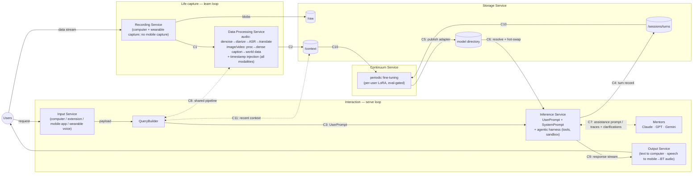

# Nucleus v0 — High-Level Architecture

> The stable system-design doc and the **home of the inter-service contracts**. Service
> internals live in each `services/<key>/CHARTER.md`; this file owns the seams between them.
> This is an evolving first version, not a frozen spec — changes to §Contracts route through
> a founders' session and a note in [HANDOFF.md](HANDOFF.md).

**Last updated:** 2026-07-27 (D19 — §Stage added; D18 — C10 evolved + C12/C13/C14 minted)

---

## Stage: PROTOTYPE (pre-dev, pre-production) — read this before believing anything below

**Ratified 2026-07-27 (D19).** Every document in this repo is written in a production voice. That
voice is aspirational, and reading it as a commitment is the single most expensive mistake a new
session can make here. **We are building a prototype: the goal is one end-to-end product that
genuinely works, as fast as we can honestly get there.**

**What this licenses.** Contracts may be **re-cut rather than versioned** — "v0 frozen" means
"stable enough to build against today", not "immutable". Stored data may be **wiped and
re-collected** rather than migrated; everything captured so far is experiment output, not user
data. Durability work (Postgres/GCS, retention sweeps, backup drills, multi-node) is **deferred on
purpose**, with the reason written down.

**What it does NOT license**, because this is the half that keeps the posture honest:
- Skipping [ORG.md](ORG.md)'s contract-edit order. A re-cut contract still edits §Contracts first,
  then `contracts/`, then **both** owning canvases. Cheap to change is not the same as unowned.
- Undocumented decisions. "Prototype" is a reason to defer work, never a reason to leave a choice
  unrecorded — the deferral itself is the thing that must be written down, or it is just a gap.
- Silent breakage. A thing we know is wrong stays wrong on the record, not quietly.
- **Claiming something is built when it is decided.** The stage changes what we build, never what
  we say about it (see D17's O-12 correction and D18's status split).

**What changes at dev/prod.** Everything parked under this banner is *tracked*, not forgotten: the
retention policy (today `keep_forever` everywhere, with the knob shipped and the sweeper not
built), the storage substrate (today SQLite + filesystem), the consent gate (D13), and the C5
freeze (D19). Each has a named home in a charter.

## The two loops

Everything in v0 is one of two loops sharing the same stores and the same per-user model:

- **Serve loop (interactive, seconds):** user asks → request is normalized and templated →
  the personal model (+ harness + mentors) answers → response is delivered; the turn is stored.
- **Learn loop (background, nightly-ish):** life stream is captured → processed into
  timestamped, enriched records → stored → periodically fine-tuned into the user's adapter →
  published for serving. The context of a day silently becomes weights overnight.

The serve loop makes the product usable today; the learn loop is why it exists.

## System diagram

```mermaid
flowchart LR
  U((Users))

  subgraph capture [Life capture — learn loop]
    RS["Recording Service<br/>(computer + wearable capture; no mobile capture)"]
    DPS["Data Processing Service<br/>audio: denoise→diarize→ASR→translate<br/>image/video: proc→dense caption→world data<br/>+ timestamp injection (all modalities)"]
  end

  subgraph interact [Interaction — serve loop]
    IS["Input Service<br/>(computer / extension / mobile app / wearable voice)"]
    QB[QueryBuilder]
    INF["Inference Service<br/>UserPrompt + SystemPrompt<br/>+ agentic harness (tools, sandbox)"]
    MEN["Mentors<br/>Claude · GPT · Gemini"]
    OS["Output Service<br/>(text to computer · speech to mobile→BT audio)"]
  end

  subgraph data [Storage Service]
    RAW[("/raw")]
    CTX[("/context")]
    SES[("/sessions/turns")]
    MD[("model directory")]
  end

  subgraph learn [Continuum Service]
    FT["periodic fine-tuning<br/>(per-user LoRA, eval-gated)"]
  end

  U -- data stream --> RS -- C1 --> DPS -- C2 --> CTX
  RS -- blobs --> RAW
  U -- request --> IS -- payload --> QB -- C3: UserPrompt --> INF
  QB <-. C8: shared pipeline .-> DPS
  QB <-. C11: recent context .-> CTX
  INF -- C4: turn record --> SES
  INF <-. "C7: assistance prompt / traces + clarifications" .-> MEN
  INF -- C9: response stream --> OS --> U
  CTX -- C10 --> FT
  SES -- C10 --> FT
  FT -- C5: publish adapter --> MD
  MD -- C6: resolve + hot-swap --> INF
```

## Components

| Component | One-liner | Charter |
|---|---|---|
| Recording Service | Captures the user's physical + digital life and lands it on our backend; privacy front line (consent controls) | [charter](services/recording/CHARTER.md) |
| Data Processing Service | Raw streams → structured, timestamped, world-enriched records; same pipeline serves interactive requests via C8 | [charter](services/data-processing/CHARTER.md) |
| Storage Service | All durable stores — `/raw`, `/context`, `/sessions`, model directory; time/user indexing, isolation, encryption, deletion primitives | [charter](services/storage/CHARTER.md) |
| Input Service | Chat surfaces + the QueryBuilder that turns a raw multimodal payload into a model-ready UserPrompt | [charter](services/input/CHARTER.md) |
| Inference Service | The brain: vLLM + per-user LoRA hot-swap, agentic harness, mentor protocol, turn logging | [charter](services/inference/CHARTER.md) |
| Output Service | Delivers responses to the right device in the right form; future home of the proactive channel | [charter](services/output/CHARTER.md) |
| Continuum Service | The magic: nightly per-user fine-tuning with replay mixtures and eval gates; publishes adapters | [charter](services/continuum/CHARTER.md) |
| Platform Service | Cross-cutting: infra, CI/CD, observability, security/privacy/compliance, cost. **Added beyond the original HLD — ratified 2026-07-09 (D1)** | [charter](services/platform/CHARTER.md) |

## Contracts (the spine)

The only coupling between services. Parallel sessions may build freely as long as these hold;
**changing one means editing THIS section first**, then notifying both owning services (rows
in their HANDOFF.md). Payload details get pinned by the owning pairs as they build (M0/M1);
what is locked now is direction, ownership, and shape.

| ID | Producer → Consumer | Carries | Notes |
|---|---|---|---|
| **C1** | recording → data-processing | Raw stream envelope: `user_id`, `device_id`, `stream_id`, `sequence`, `chunk_id`, modality, codec, wall-clock `t_start/t_end`, blob ref (+ sha256/bytes), optional device location/clock | **v0 frozen (learn-loop, below).** One envelope format for all four modalities; blobs land in storage `/raw` first, the envelope carries the ref; push/at-least-once, dedup on `chunk_id`, gaps via `(stream_id, sequence)`; location populated where the device has it, else data-processing infers from content |
| **C2** | data-processing → storage `/context` | Processed record: timestamps, transcript/caption content, enrichments (speakers, known faces, geo/place tags, objects), raw ref, pipeline version | **v0 frozen (learn-loop, below).** Timestamp spine: concurrent activities from different devices must be alignable |
| **C3** | input (QueryBuilder) → inference | **UserPrompt**: chat-templated multimodal request + session/turn ids + client capabilities | The seam where "user request" becomes "model input"; a *clarification-answer* variant binds a reply to a pending turn (see C7/C9) |
| **C4** | inference → storage `/sessions` | Turn record incl. **full mentor traces + tool traces** | Traces are continuum's training data — never truncate |
| **C5** | continuum → model directory | Adapter version entry — **described AS BUILT, deliberately NOT frozen** (the freeze needs inference at the table; founders ratify — field names may still move, and writing them here does not pin them): `contract:"C5"`, `user_id`, `adapter_version`, `adapter_dir`, `base_model_hash`, `training_window`, `recipe_id`, `eval_report`, `status` ∈ **`active` \| `gate_failed` \| `rolled_back`** — nine fields (`services/continuum/app/publish.py:83-99`) | Publish is eval-gated; rollback is first-class. **`gate_failed` is the audit row for a candidate the gate blocked** — appended for lineage, never eligible to serve, with `adapter_dir` and `base_model_hash` NULL (`publish.py:101-114`). Entries live today in continuum's own `var_dir/model_directory/entries.jsonl`; the storage-hosted directory is still ahead of us, and **three things the short field list used to hide must survive the swap**: `status` is a *three*-value enum, `gate_failed` rows carry NULLs where the happy path carries paths, and C6 eligibility replays the log (`active` pushes, `rolled_back` pops, **`gate_failed` does neither**) rather than taking the latest row. See [storage charter](services/storage/CHARTER.md) §Model directory |
| **C6** | model directory ↔ inference | `resolve(user_id)` → latest eligible adapter; hot-swap in vLLM per request | Same mechanism during fine-tuning windows |
| **C7** | inference ↔ mentors | Assistance prompt out (system + user + user-context injection); thinking/plan/response traces back; **clarification-question relay** through our model to the user and back | Mentor traces route into C4 |
| **C8** | QueryBuilder ↔ data-processing | The stream pipeline exposed as a **synchronous API** | Interactive requests get identical normalization to the life stream — one pipeline, two entry points |
| **C9** | inference → output | Grounded **response-stream envelope**: token/text stream, mid-turn frames (mentor clarification questions, status), end-of-turn metadata | The only serve-loop hop after C4; mid-turn clarification frames are C7's user-facing leg — answers return as the C3 clarification-answer variant |
| **C10** | storage → continuum | **Training-window read — RATIFIED AS A DAY-LOG FETCH + WATERMARK WINDOW (D18, 2026-07-26; **BUILT 2026-07-27** (`a5a48fb` storage · `1757efb` continuum · `2698b63` DP)).** Storage materializes the segment/block day-log and owns the per-user training-window ledger; continuum fetches, never builds. Four operations: `POST /training/windows {user_id}` → **idempotent get-or-create** of the user's currently-open window `{window_id, t_start, t_end}`; `GET /training/daylog?user_id=&window_id=` → the materialized day-log for **any** window (random access over history — replay re-reads *prior* day-logs, so this is not a forward cursor); `GET /training/windows?user_id=&state=` → window enumeration (`open`\|`consolidated`), the "which windows has this user consolidated?" read continuum today infers from the reservoir ledger; `POST /training/windows/{window_id}/close {outcome}` → advances the watermark. The raw range read `GET /context/records?user_id=&from=&to=` **is NOT replaced** — it stays first-class (D12's beta training feed, debugging, C11-adjacent). Day-log body + watermark rules in the learn-loop block below. | **The window is `[last_trained_t, now−δ)` on storage's `ingest_time` axis** — not event time, not a local date. Consequences: storage needs **no timezone** to serve C10; a missed or gate-failed night is **absorbed** into the next window; and **late-arriving records cannot be lost, because on an ingest-time watermark "late data" does not exist** — `ingest_time` is assigned by storage at write, so a record can never land below an already-closed boundary (`δ`, default 60 s, covers in-flight writes racing the boundary). **`last_trained_t` advances if and only if a cycle PUBLISHES** (refined 2026-07-27; D18's first draft also advanced on `skipped_no_data`). Every other outcome — gate failure, freeze, crash, no data, and *too little* data — leaves the watermark, so the next window is a strict superset. One sentence now covers all five, and it makes the watermark's name literally true: **`last_trained_t` is the high-water mark of what has actually been trained into this user's adapter**, which is the property that makes it auditable. It also makes the min-data floor nearly free — a night below the floor simply does not advance, so the material accumulates until it is worth a run, with no separate carry-over mechanism. Cost, named: an inactive user's open window grows unboundedly and is re-scanned nightly. That is correct (there is nothing to train) and cheap at v0 scale. Window bounds are **immutable once opened**, so a retry re-opens the *same* `window_id` and `cycle.py`'s crash-safe journal replay is preserved. `window_id` is an **opaque, path-safe, lexicographically-ordered per-user token**, minted once per window from its end instant — `w<YYYYMMDD>T<HHMMSS>Z` (e.g. `w20260721T110000Z`); **no consumer may parse it**. The `/sessions` (C4 mentor-trace) leg of this row is unchanged and remains **unbuilt** — v0's day-log derives from `/context` only. |
| **C11** | storage → input (QueryBuilder) | **Recent-context read**: recency/semantic retrieval over `/context` + `/sessions` for same-day grounding | Bridges the gap before the nightly cycle lands in weights; the index lives in storage, QueryBuilder decides what enters the UserPrompt |
| **C12** | storage → continuum · (later inference / input) | **User profile read (per-user POLICY)**: `GET /users/{user_id}/profile` → `{contract:"C12", version:"0", user_id, home_tz, profile_version, updated_at}` (`contracts/c12_user_profile.v0.json`) | Minted **D18** (2026-07-26) — the contract home for D17's `home_tz`. **v0 carries exactly one policy field: `home_tz` (IANA, REQUIRED)**, whose only jobs are **scheduling** the nightly cycle and **fallback** when a record carries no `device_tz` (§Ownership splits → *User timezone*). **404 when no profile exists — there is no server-side default timezone anywhere** (D17), and a user with no `home_tz` is **not schedulable**: an operational alert, never a silent skip. **Storage never writes `home_tz` on its own** (corrected 2026-07-27; D18's first draft had it auto-seed from the first device-reported `device_tz`). `home_tz` is **declared, not inferred**: the user sets it, and the device's current zone may be offered as a *suggestion in the UI* but is never stored as if it were an answer. The reason is the same one that forbids auto-*update* — a zone the system guessed and a zone the user chose are different facts, and only the second can be wrong in a way the user can correct. It follows that **`home_tz` does not move when the user travels**: a week in Tokyo changes every record's `device_tz` and changes nothing here, so the consolidation boundary stays put instead of jumping 9 h and producing a 15 h night followed by a 33 h one. That is the FACT/POLICY split doing exactly its job. It is a **profile, not a settings blob**: it holds values *the system reads to decide its own behaviour* for this user (scheduling, fallbacks, policy), never user-facing identity or presentation — those belong to input. Expected second field, deliberately **not** minted until it has a consumer (E-5 precedent): a per-user `boundary_local_time` override — today a *global* recipe knob, which cannot express a night-shift worker. It cannot ride C13: `recipe_id` is global + versioned (`recipe_id` == filename stem), so a per-user value there forks `recipe_id` per user. The **write** surface is storage-owned and prose-pinned (D11's `/raw` precedent) until input ships a settings consumer |
| **C13** | storage → continuum + inference | **Recipe registry fetch**: versioned consolidation/serving recipes, and the separately-versioned gate policy, by id | Minted **D18** (2026-07-26). `recipe_id` == filename stem, **global and versioned** — a recipe is never per-user. The **gate policy is a separate artifact with its own id** (ratified with gate v1.1, 2026-07-24): only the *training recipe* may enter a cycle stage key, so changing a publish threshold must never fork `recipe_id` or invalidate hours of GPU cache. Continuum's `LocalRecipeRegistry` (`app/clients/registry.py`) is the reference implementation to lift |
| **C14** | continuum ↔ storage | **Reservoir**: write a night's amplified corpus (append-only, keyed `(user_id, window_id, recipe_id)`, content-hashed); read the ledger | Minted **D18** (2026-07-26). **Audit / provenance — NOT the replay hot path**: replay re-reads prior *day-logs* via C10 (the locked architecture; raw-source is a measured tie with amplified, and simpler). The one invariant it exists to protect: **amplified / synthetic text never lands in `/context`** — same storage discipline, different namespace. Admission is append-only and **deletion here is a deliberate privacy act, never housekeeping** |

### Frozen MVP shapes — serve-loop v0.0 (2026-07-09)

The **minimal, text-only** shapes the serve-loop MVP builds against. Machine-readable JSON
Schemas are the source of truth in [`contracts/`](contracts/); the prose here is the summary.
**Versioning:** these are `version: "0"`. They *will* grow (more modalities, mid-turn frames,
adapters) — additive fields are fine without ceremony; any **breaking** change bumps the version
and updates the schema file + this section. The **serve-loop** v0.0 slice exercises C3, C9, C4, C6
(below); the **learn-loop** v0.0 slice adds C1, C2 (further below). C5/C7/C8/C10/C11 are not
touched until their slices.

- **C3 UserPrompt v0** (`contracts/c3_userprompt.v0.json`): `{contract:"C3", version:"0",
  user_id, session_id, turn_id, created_at, messages:[{role:"user"|"system", text}],
  client_capabilities:{surface, modalities:["text"], can_render_markdown}, template_version}`.
  MVP: one user message; inference prepends the system prompt.
- **C9 Response stream v0** (`contracts/c9_response_stream.v0.json`): an HTTP streamed body —
  answer **text chunks**, then a single `\x1e` (U+001E) separator, then one JSON **end frame**
  `{turn_id, model_id, adapter:"base", usage:{prompt_tokens, output_tokens}, finished:true}`.
  Errors: an end frame with `{error:"..."}`. Mid-turn frames are **reserved, not emitted** in v0.
- **C4 Turn record v0** (`contracts/c4_turn_record.v0.json`): `{contract:"C4", version:"0",
  user_id, session_id, turn_id, user_prompt:<C3>, response_text, model_id, adapter:"base",
  created_at, completed_at, tool_traces:[], mentor_traces:[]}`. Trace arrays are empty in v0
  (no harness/mentors yet) but present so the shape never changes when they arrive.
- **C6 resolve v0** (`contracts/c6_resolve.v0.json`): `GET resolve?user_id=…` →
  `{model_id:"Qwen/Qwen3-VL-32B-Instruct", adapter:"base", adapter_path:null}`. Trivial until
  continuum ships per-user adapters.

### Frozen MVP shapes — learn-loop v0.0 (2026-07-09)

The **minimal, audio-only** shapes the learn-loop (capture) MVP builds against — the barebones
path **computer mic → ASR → `/context`**. Machine-readable JSON Schemas are the source of truth
in [`contracts/`](contracts/); the prose here is the summary. Same versioning rule as the
serve-loop block: `version:"0"`, additive fields free, breaking changes bump the version + edit the
schema file + this section. v0.0 exercises **one device+modality** (computer mic, `audio`); the
shapes carry all four modalities so the vision/text pipelines add records without a reshape.

- **C1 Raw-stream envelope v0** (`contracts/c1_raw_stream_envelope.v0.json`) — C1 has **two legs**:
  - **Blob leg (recording → storage `/raw`):** recording `PUT`s the raw chunk bytes to storage
    `/raw` **first**; storage mints an **opaque `blob_ref`** (idempotent on `chunk_id`). Only
    storage resolves the ref; data-processing pulls the bytes by ref for ASR. Pinned as prose here
    (like C9's wire format), **not** a separate C-number.
  - **Envelope leg (recording → data-processing):** `{contract:"C1", version:"0", user_id,
    device_id, stream_id, sequence, chunk_id, modality, codec, t_start, t_end, blob_ref,
    blob_sha256, blob_bytes, device_tz?, device_utc_offset_minutes?, device_location?,
    device_clock?}`.
  - **Civil-time context (additive, 2026-07-26 — D17).** `t_start`/`t_end` stay the canonical
    **instant**, device wall-clock RFC3339 **UTC**. Alongside them the capturing device reports
    **`device_tz`** (IANA zone id, e.g. `America/Los_Angeles` — never an abbreviation like "PST",
    which is ambiguous and DST-sensitive) and **`device_utc_offset_minutes`** (the offset the device
    *believed* at capture — not merely derivable from `device_tz`, because it is the independent
    witness when a device's tzdata is stale or wrong). **Rationale:** the capturing device is the
    only thing that knows where the user was at that moment; every client already computes the local
    instant and converts it to UTC, discarding the zone on the same line. UTC alone answers duration
    queries ("the last 24 h"); it cannot answer civil-time questions ("the user's Tuesday 09:00–17:00")
    or render an honest local anchor line. **Both fields are optional-additive** (no version bump);
    a client that omits them degrades to the user's profile `home_tz`.
  - **Delivery semantics (frozen):** **push, at-least-once**; consumers idempotent on **`chunk_id`**
    (the dedup key — a client-minted ULID, stable across retries); ordering + gap detection via
    **`(stream_id, sequence)`**, where `sequence` is **dense, zero-based, +1 per chunk** within a
    **globally-unique** `stream_id` (any break — including a non-zero first-seen value — is a lost
    chunk → "zero silent loss"); **blob-first** write invariant (blob durable in `/raw` before the
    envelope is emitted, so `blob_ref` does not dangle at emit — consumers still tolerate a
    since-deleted blob, since `/raw` deletion + re-pull-by-ref both exist).
- **C2 Processed record v0** (`contracts/c2_processed_record.v0.json`): `{contract:"C2",
  version:"0", record_id, user_id, source:{device_id, stream_id, chunk_id, blob_ref, modality,
  device_tz?, device_utc_offset_minutes?, device_location?}, t_start, t_end,
  content:{kind:"transcript", text, language?, segments?:[{t_start, t_end, text,
  speaker}]}, enrichments:{speakers:[], faces:[], places:[], objects:[]}, pipeline_version,
  discriminator?, processed_at}`. `record_id` is a **deterministic function of `(chunk_id, pipeline_version,
  within-chunk discriminator)`** — so reprocessing is an idempotent `/context` upsert and a
  `pipeline_version` bump forks a new record (version-forward). The **discriminator** is what keeps
  a chunk's *multiple* records distinct and individually stable (video keyframes, an `ocr` record
  beside a `caption`, original+translation); it is `""` in the 1:1 case, and an empty discriminator
  reproduces the two-component v0 id **byte-for-byte**, so nothing forked when it landed
  (`services/data-processing/app/pipeline.py:33-46`). This is **not a contract change**: the frozen
  schema has mandated the discriminator since v0
  (`contracts/c2_processed_record.v0.json` → `properties.record_id.description`, "fold a
  within-chunk discriminator into the id so each is stable and distinct") — the schema is
  authoritative and was already correct; only this prose summary lagged it, and now matches.
  `enrichments` is **present-but-empty** in v0 (mirrors C4's empty trace arrays)
  so diarization / world-data never reshape it. Storage assigns `ingest_time` — **not** carried in
  C2.
  - **`discriminator` surfaced (additive-optional, 2026-07-27 — D18 follow-through).** The
    within-chunk discriminator has fed `record_id` since v0 but existed **only inside the hash**,
    so a reader holding two records could not tell whether they were two units of one chunk or two
    dialects of one unit. C10's one-dialect-per-record rule needs exactly that distinction, so the
    value is now **emitted**: `discriminator` is a top-level optional string, absent or `""` in the
    1:1 case. **This surfaces an invariant that already existed and is already enforced** —
    data-processing rejects duplicate discriminators within a chunk at
    `services/data-processing/app/stagegraph/executor.py:396-401` — so it adds no new promise, only
    visibility. **`record_id` is unchanged**: the value was already folded in, and an empty
    discriminator still reproduces the two-component v0 id byte-for-byte
    (`app/pipeline.py:33-46`). Nothing re-keys. Mirrors must move with the schema — DP's `C2Source`
    and storage's `Source` are `extra="forbid"`, the trap D17 hit.
  - **Civil-time passthrough (additive, 2026-07-26 — D17).** `source.device_tz`,
    `source.device_utc_offset_minutes` and `source.device_location` are **carried verbatim from the
    C1 envelope**. Data-processing performs **no timezone logic whatsoever** — it does not derive,
    validate, normalize or infer a zone; it copies provenance, exactly as it already copies
    `device_id`/`blob_ref`. These fields are therefore **not** subject to the record-emission law's
    T2 "reachable consumer" test, which governs *signals DP produces*, not envelope provenance it
    forwards. A record whose chunk carried no zone simply omits them.
  - **Timestamps stay UTC-canonical.** `t_start`/`t_end` remain the instant and the sole ordering
    and range-query axis; the zone is *context* stored beside them, never a replacement. Anything
    reading a local wall-clock reads `t_start` + the record's `device_tz` (falling back to the
    user's profile `home_tz`). See §Ownership splits → *User timezone*.

### C10 evolved — the day-log fetch + the watermark window (D18, 2026-07-26 — **BUILT 2026-07-27** (`a5a48fb` storage · `1757efb` continuum · `2698b63` DP))

Ratified at the storage/C10 board session. Schemas land in [contracts/](contracts/) as the build
slice's **first act**, per that directory's own rule ("C5/C7/C8/C10/C11 get schema files when their
slices start"); the shapes below are the pin.

- **`window_id` — an opaque, path-safe, lexicographically-ordered per-user token.**
  Format `w<YYYYMMDD>T<HHMMSS>Z`, e.g. `w20260721T110000Z`, derived from the window's **end
  instant** in UTC. Three properties are load-bearing and none of them is decorative:
  **(1) path-safe** — it is a filesystem path component and an `rmtree` target
  (`services/continuum/app/ids.py:8`; `journal/`, `cycles/`, `reservoir/`, `adapters/`), and a raw
  RFC3339 instant **fails** that regex because of its colons; **(2) lexicographic order ==
  chronological order**, because it is compared *as a string* in four places — `publish.py:83`
  (`active_before`, the resume-from lineage) and `publish.py:106` (**the alias-monotonicity guard
  itself** — "never move the serving alias backward"), `cycle.py:106,115` (journal debt +
  `latest_window`), `reservoir.py:105` (replay's `before_window` filter); fixed width + zero
  padding is what guarantees it. **(3) Second granularity, not minute** — a truncating id can
  silently collide two distinct windows (a manual catch-up, a re-drive, a test), and an id
  collision corrupts the journal, the reservoir and C5 lineage at once. Belt and braces: the cycle
  **refuses a window whose end is not strictly greater than `last_trained_t`**, so a collision is
  impossible by construction rather than by luck.
- **Meaning is minted, never parsed.** The id is derived in **exactly one place** (a
  `mint_window_id(end_utc)` + `validate_window_id()` pair, regex `^w\d{8}T\d{6}Z$`); every consumer
  treats it as opaque and may rely on `<` / `>=` **and on nothing else**. This deletes
  `Window.local_date` (`window.py:44`) and `ReservoirEntry.local_window_date()`
  (`reservoir.py:65-69`), the two places that parse the id back into a date today — and with them
  `cycle.py:217`, which rebuilds *prior* windows by re-deriving their bounds from that parsed date
  under *tonight's* timezone. Prior windows are no longer reconstructed at all: they are
  **enumerated and fetched** from storage, which is why the window-enumeration read above is
  load-bearing rather than a convenience.
- **Why the format must change, and it is not a cost of the change — it is a consequence.** Under
  `[last_trained_t, now−δ)` there is no local date to name: a window can span 23 h, 25 h, or (after a
  missed night) 47 h. Keeping `w<local-date>` would mean *synthesising* a local date purely to name
  a window — reintroducing the timezone dependency into a query we just proved needs none, and
  making the id lie about the window's extent. **You cannot have the watermark window and keep the
  current format honestly.**
- **What re-keys, stated in full so nobody discovers it later.** (a) Filesystem paths —
  `journal/{user}/{window_id}.json`, `cycles/`, `adapters/`, `reservoir/{user}/{window_id}.corpus.txt`
  + `.meta.json`; old dirs are **orphaned, not corrupted**, and need no migration for correctness.
  (b) The four string comparisons above stay correct **provided one user's history uses one format**
  — mixed formats order correctly only by ASCII accident (`-` = 0x2D sorts below `0` = 0x30), so the
  reservoir cutover must be explicit and tested, never trusted. (c) **The training seed** —
  `cycle.py:147` `seed = int(_h(user_id, window_id)[:8], 16)` — so amplification variant selection
  and replay sampling change, and **a night re-run across the change is not apples-to-apples**. We
  accept that discontinuity rather than re-pinning the seed on a "stable" value that is itself
  changing; anyone needing a controlled comparison pins it explicitly, which is a recipe change.
  **The `tests/parity/` suite is unaffected** — it seeds from its own harness, not from `window_id`.
  (d) `seg_id` = `{window_id}_s{n:05d}` (`daylog.py:88`) and `block_id` = `{window_id}_b{n:04d}`
  (`daylog.py:206`) re-key; both are regenerated per window, so no migration. (e) **C5
  `training_window` lineage forks** — small today (the M0 demo entries).
- **`w-day5` is a mess, not a precedent.** Both on-disk C5 publishes carry the literal `w-day5`
  because `scripts/m0_smoke.py:133` writes `f"w-day{args.day}"` and never calls `window_for`. That
  string breaks the total order twice over (`w-day10` < `w-day5`; all `w-day*` sort below all
  `w2026-*`). It is harmless only because it is a smoke script — but it proves the real lesson:
  **the ordering invariant is only as strong as the discipline that mints ids, and today nothing
  enforces it.** Hence the single minter + validator above; `m0_smoke.py` moves to it.
- **The window is opened, not computed.** Storage mints `(window_id, t_start, t_end)` **durably and
  idempotently**: `POST /training/windows` returns the user's already-open window if one exists.
  This is what preserves the cycle's crash-safe idempotency, which an end-instant id would otherwise
  destroy — recomputing `now` on a retry would mint a *fresh* id, a fresh journal, and therefore a
  full re-train, a second C5 entry and a second reservoir admission.
- **Day-log body** (`GET /training/daylog?user_id=&window_id=`):
  `{contract:"C10", version:"1", user_id, window_id, t_start, t_end, daylog_format_version,
  recipe_id, home_tz, segments:[{seg_id, t_start, t_end, caption[], asr[], ocr[], quality, tz}],
  blocks:[{block_id, seg_ids[], text, anchors{}, quality}], content_fingerprint}`.
  `daylog_format_version` + `recipe_id` satisfy the recipe-versioning requirement — and the
  requirement is satisfied by the CONSUMER, not by the stamp: continuum's `HttpDayLogClient`
  compares both against the night it is about to run and **refuses** (`DayLogDialectMismatch`,
  window left open, exit 2) rather than training on a dialect or a recipe it did not expect
  (F3, 2026-07-27 — until then both fields were written by storage and read by nobody, which
  is exactly the silent format change the fields exist to prevent). The two pins are set
  INDEPENDENTLY (`STORAGE_DAYLOG_RECIPE_ID`, `CONTINUUM_RECIPE_ID`), so a half-finished re-pin
  is an ordinary deployment slip that only the consumer can detect: storage renders honestly
  under its own pin and stamps what it rendered, while publish writes CONTINUUM's `recipe_id`
  into C5 — so the artifact would be audited as trained under a recipe it was not trained
  under. `home_tz` records
  **the fallback zone actually used**, which closes the D17 follow-up that a wrong-timezone adapter
  is otherwise unfalsifiable after the fact. `content_fingerprint` is computed **by whoever renders**
  and is only ever compared to *itself* across runs (it is a journal stage key, not a cross-backend
  equality claim) — at cutover it changes once and that night re-runs, which is correct, because the
  input source genuinely changed.
- **Materialization rules (these are where the watermark's substance lives).**
  - *Membership is by `ingest_time`; bucketing is by `t_start`.* A window contains every C2 record
    whose `ingest_time` falls in `[t_start, t_end)`, **whatever its event time** — so a chunk
    captured Tuesday and uploaded Friday trains in Friday's window, rendered in a block anchored
    "On [Tuesday]". Content stays event-time-correct because blocks are formed by **temporal
    adjacency** and carry their own local anchors; a backlog simply forms its own blocks.
  - *`seg_id` is an opaque ordinal label with no cross-materialization stability guarantee* (D20).
    What is stable is the **bucket grid** below, which decides grouping; the *label* is the
    segment's position in the rendered day-log, so a re-materialization that drops a record (the
    one-dialect rule) legitimately renumbers everything after it. Nothing external stores a
    `seg_id`: it is written to `segments.jsonl` and read by no trainer. Consequently it is **not**
    part of the day-log's byte-identity bar — see storage CHARTER M9(b), which requires instead
    that the relabelling be an order-preserving bijection with per-block membership preserved.
  - *Segment buckets sit on a **global** epoch grid* (`floor(t_start / segment_seconds)`), not
    relative to the window start. This is required — window-relative indices go negative once
    membership is on the ingest axis — and it is also **better**: a segment's bucket is then
    stable across re-materialization. **Both renderers do this as of 2026-07-27 (F4).**
    Continuum's local `build_daylog` bucketed window-relatively until then, and storage's M9
    differential proof hid it behind a fixture whose event-window origin was chosen *aligned* to
    the segment grid — the one origin for which the two rules agree, and one **no real window
    has** (windows are `[watermark, now−δ)` at second granularity). Measured before the fix:
    shifting that fixture's origin 1–9 s broke M9 tier A at every one of the nine — segment
    bounds always, **block text** (the training artifact) at eight, and at +3 s the segment count
    and per-block membership as well. The proof now runs its whole origin-dependent bar over an
    aligned **and** a misaligned origin, and asserts of each that it is what it claims to be.
  - *One dialect per record, latest wins.* Among records sharing
    `(chunk_id, content.kind, within-chunk discriminator)`, the materializer keeps the one with the
    **latest `ingest_time`** and drops the rest. `pipeline_version` is a *composed* string
    (a mutate stage's enabledness is its version fragment) and therefore **not orderable** —
    `ingest_time` is storage's own monotone clock and is. It must key on `content.kind`, because
    Phase-3 proved captions and transcripts can share one `pipeline_version`. **This is what
    actually fixes the cutover double-count** (`daylog.py` filters on neither `kind` nor
    `pipeline_version` today), and it demotes **E-2** from a correctness blocker to the retraction /
    privacy / space primitive it should always have been. **Named blocking sub-item for the
    builder:** the discriminator is today folded into the `record_id` hash and is **not
    independently readable from C2** — the build slice must either surface it as an additive
    optional C2 field or prove `(chunk_id, kind, t_start)` unique per dialect. Do not hand-wave it.
- **Watermark advance + the outcome rule.** `last_trained_t` advances **if and only if the cycle
  PUBLISHES** *(refined 2026-07-27; this bullet carried D18's first draft, which also advanced on
  `skipped_no_data`, and was the last of four sites to be corrected — see the C10 row above)*. Gate
  failure, freeze, crash, **no data** and **too little data** all leave it where it is, so the next
  window is a strict **superset** of the failed one — the design-of-record's failed-day merge,
  obtained structurally rather than by the `_UserState.debt` bookkeeping it demotes. Strike
  counting is unaffected: each failed night is a distinct (larger) window, so each strikes once, and
  `active_before` still resumes from the last **`active`** entry because a `gate_failed` row never
  enters the activation stack.
- **`pipeline_version` bumps are a forward-only correction.** A bump mints new `record_id`s, hence
  new `ingest_time`s, hence they land in the *next* window and the day-log renders the new dialect.
  The old dialect is **not un-trained** — on an append-only weight chain that is irreducible. The
  remedy for a dialect bad enough to need repair is a deliberate **rebuild from base over retained
  history**, which storage's retained day-logs + the reservoir make possible; it is named here as
  the escape hatch and is not built. **Accepted, named cost:** the same lived moment can be trained
  twice in two dialects. Suppressing already-rendered chunks would prevent the double exposure but
  would also prevent the *correction* from ever training — and since we bump precisely because the
  old dialect was worse, **training the correction wins**. Tracked as a storage OQ, not built.

## Ownership splits (pinned — cross-referenced from the charters)

Where a responsibility naturally touches several services, the split is decided **here**, once:

| Concern | Split |
|---|---|
| **Wearable device** | **Camera + mic only — no speaker** (current bodycam market has none). Recording owns the device pick + capture firmware; input owns the on-device interaction UX (push-to-talk). |
| **Mobile app (v0 surface)** | A first-class v0 client that **does not capture** (no screen recording). Input owns it as an interaction chat surface; output uses it as the **speech-output sink**. Only *mobile screen capture* is deferred (§Decisions), not the app. |
| **Speech output routing** | The wearable has no speaker, so synthesized speech is delivered to the **mobile app**, which plays it to connected headphones/earbuds (Bluetooth audio). Output owns delivery + routing; mobile is the default speech sink until a speaker-equipped wearable exists. |
| **Durable data custody** | ALL durable stores live in storage — `/raw` (blobs recording writes via ingest), `/context`, `/sessions`, model directory. No service keeps its own durable user data. **`/raw` upload path:** storage owns the bucket + namespace + `blob_ref` minting; recording is the *writer* — M0 proxies bytes through storage's `PUT /raw/blobs`, prod lean is storage mints a **signed GCS URL** and recording uploads **directly to GCS** (bytes bypass storage's process) then the `blob_ref` points at that object. Uploads run async; the C1 push fires on upload-complete. |
| **Deletion (right-to-be-forgotten)** | Storage owns per-store delete primitives (incl. `/raw` and adapter artifacts). Platform owns the cross-store orchestration + proof-of-deletion, calling storage/continuum primitives. Deletion-vs-trained-weights: v0 default is full retrain from retained records; final policy is an open research question (continuum × platform). |
| **Consent** | Platform owns consent policy + the consent-record store and gate ("no consent record ⇒ no ingest"). Recording owns on-device enforcement (pause / mute / delete-last-N, capture indicators). Bystander-consent policy is decided by platform, enforced by recording. |
| **BWM (base world model)** | The pick is recorded in §Decisions below. Inference owns artifact custody + serving. Continuum pins the base-model hash per adapter (C5) and executes upgrade migrations (fleet retrain) — upgrades are explicit, never hot. |
| **People/known-faces registry** | Data-processing owns matching/enrichment; storage persists the registry; input owns the curation + consent UX surface. Voice-to-person linking (known-vs-unknown *speakers*) rides the same registry — deferred-vs-v0 is data-processing's call, recorded in its charter. |
| **Same-day context** | Weights only know up to the last nightly cycle. The recent-context read path (C11) is owned by input's QueryBuilder; the recency/semantic index behind it lives in storage. |
| **User timezone** (D17, 2026-07-26) | **Two different things, two different owners — conflating them was the original bug.** **(1) The FACT — where the user actually was at a moment:** owned by the **capturing device**, reported per chunk as `device_tz` + `device_utc_offset_minutes` on C1, carried verbatim by data-processing into C2 `source{}`, and persisted by storage beside the UTC instant. The device is the only thing that can know this, and it already does — every capture client computes the local instant and discards the zone converting to UTC. This is what renders an honest local anchor line, and it is **correct under travel** by construction. **(2) The POLICY — when is this user's night?:** owned by **storage**, as a per-user profile value **`home_tz`** (IANA), **declared, not inferred** — the user sets it; storage never writes it on its own, and a client may only *suggest* the device zone in a UI. It therefore does not move when the user travels (D19, correcting D18's first draft). Its *only* job is **scheduling** — deciding when a user's nightly consolidation fires — plus serving as the **fallback** when a record carries no `device_tz`. It is not the pipeline's time semantics. **Timestamps stay UTC-canonical everywhere:** UTC is the sole ordering and range-query axis (`GET /context/records?from=&to=` needs no zone at all); the zone is context stored *beside* the instant, never instead of it. **Never store a derived local time** — `device_local_time` is fully recoverable from instant + zone, and persisting it creates two sources of truth that will eventually disagree with no rule for which wins. **Never store abbreviations** (`PST`, `MST`) — ambiguous and DST-sensitive; IANA ids only. |
| **Day-log: representation vs. content** (D20, 2026-07-27) | **Storage owns the day-log's REPRESENTATION outright; its CONTENT is a contract neither service may move alone.** Continuum issues a warrant — `(user_id, window_id)` — and takes what comes back; it has no say in how the artifact is built. **Storage's, to change freely:** `seg_id` labelling, ordering labels, the `content_fingerprint` algorithm, table schema, endpoint shapes, caching, and *when* materialization happens. **NOT storage's, and the distinction is the point:** the block **`text`** and its **`anchors`**. That string *is* the training corpus — it is what the amplifier reads and what replay pools (`blocks_text` joins `b.text`) — so re-shaping the anchor line or the Scene/Heard/World labels changes what the model learns and makes every number measured to date incomparable, **silently and with no error**. A change there is a versioned contract act: bump `daylog_format_version`, and re-run the differential proof. That is precisely why the C10 body carries `daylog_format_version` + `recipe_id` at all — so such a change is *announced*, never shipped as an implementation detail. The rule of thumb: **if the trainer can see it, it is contract; if only storage can see it, it is storage's.** |
| **Day-log + training-window custody** (D18, 2026-07-26) | **Storage materializes, continuum consumes — the day-log is a derived VIEW over C2, and it lives with C2.** Storage owns: the scheduled materialization (C2 records → ~10 s segment rows → gap-bounded scene blocks → anchored block text), the **retained** day-logs (random-access by `(user_id, window_id)`), the per-user **training-window ledger** + the `ingest_time` watermark, and the sole `window_id` minter. Continuum owns: the **amplifier's** renderer — `Profile.render_block` (`services/continuum/app/morpheus/profiles/`), which is *recipe-coupled* and is the surface locked byte-identical against the research line — plus the trainer-seam file materialization (`segments.jsonl` / `blocks.jsonl` / `day.txt`, `app/renderer.py`). **These are two different renderers and only one of them moves:** `daylog.py:183 _render_block` (the product labeled-lines renderer over C2 records) goes to storage and has never had a research golden; `Profile.render_block` (`morpheus/profiles/speed.py:89`, the 1427/1427 parity surface over 5-min description dicts) **stays**. `morpheus/blocks.py:5-7` already drew this line — *"Keeping that boundary narrow is what lets the day-log move behind a storage client without any kernel noticing."* **The decisive reason for the split is replay, not tidiness:** replay re-reads *prior* day-logs every night, so a continuum-side builder would re-pull every prior day's raw records nightly — O(days²) across the wire to rebuild an artifact storage could simply have kept. Two consequences that are obligations, not notes: the day-log renderer needs both `device_tz` (per record) and `home_tz` (per user, C12), so **materialization depends on the profile contract**; and **the day-log is a second copy of user content, so storage's deletion primitives (M5) must cascade to it** — a retraction that clears `/context` and leaves a materialized day-log standing has deleted nothing. The same cascade binds the reservoir (C14). |
| **Observability** | **Every service exposes a `/metrics` endpoint and ships its Grafana dashboard JSON** (per-service ownership). Platform runs the ONE shared Prometheus + Grafana + standard exporters and provisions those dashboards. See §Observability. |

## Observability (cross-cutting requirement — every service)

Decided 2026-07-09 (D9). Observability is a **standing obligation on every service**, not an
add-on: an always-on system needs both founders to open one place and see any service's health.

- **Each service exposes `/metrics`** (Prometheus text format) on its own port. Baseline every
  service emits: **request rate, request-latency histogram, error rate**. *(Implementation note:
  the first two services to ship `/metrics` — data-processing + recording, 2026-07-19 — use a
  **zero-dependency in-house emitter** (`app/metrics.py`: a pure-ASGI middleware, no bodies
  touched) rather than pull `prometheus-fastapi-instrumentator` into the frozen requirements, to
  keep the headless/CI suite dependency-free; other services may use a library if they prefer.
  Non-HTTP work emits equivalent counters.)*
  Service-specific additions: **inference → GPU** (via dcgm-exporter), **storage → DB/query**
  metrics, **data-processing → pipeline throughput/queue depth**, **recording → ingest rate +
  capture-health**, **continuum → training-job + eval-gate** metrics.
- **Each service owns a Grafana dashboard JSON** in its repo (`services/<key>/dashboards/*.json`)
  — the service knows what's worth showing.
- **Platform runs ONE shared Prometheus + Grafana** (pinned port, see [STACK.md](STACK.md)),
  scrapes all `/metrics`, runs the standard exporters (node/CPU, dcgm/GPU, DB), routes alerts,
  and **auto-provisions** each service's dashboard JSON. Both founders use a single Grafana URL
  and pick any service.
- **Build split:** service agents instrument (`/metrics` + dashboard JSON); Platform builds the
  backbone (Prometheus/Grafana/exporters/provisioning). This is the *design pattern*, not an
  inter-service payload — it is **not** a C-series contract; it is a convention pinned here +ports
  in [STACK.md](STACK.md).
- **Scope note (CTO):** node/CPU/host graphs are **placeholders** until the true multi-node
  microservice split (today everything shares one box). The metrics that mean something *now* are
  **app latency, error rate, and GPU** (inference). We wire the plumbing anyway so the graphs
  light up for free when services spread across nodes.

## Request walkthrough (serve loop)

1. User speaks/types/snaps via a surface (Input Service) → payload envelope.
2. QueryBuilder normalizes the payload through data-processing (C8) and assembles the
   UserPrompt (C3).
2b. QueryBuilder may also pull same-day grounding via the recent-context read (C11).
3. Inference resolves the user's latest adapter (C6), builds system + user prompt, runs the
   agentic harness (tools, sandbox). If the model wants help it fires the mentor protocol
   (C7); mentor clarification questions relay to the user as C9 mid-turn frames, and the
   user's answers return as C3 clarification-answer variants.
4. Grounded response streams to the Output Service (C9) → device. Turn (with all traces) → C4.

## Day walkthrough (learn loop)

1. All day: wearable + computer stream via C1; data-processing denoises/diarizes/transcribes/
   captions, injects timestamps, enriches with world data (known faces, geolocation, place
   tags); records land in `/context` (C2).
2. Nightly: continuum pulls the cycle window via the training-window read (C10) and curates
   the day's `/context` + `/sessions` (incl. mentor traces) into a
   training mixture with anti-forgetting replay, trains the user's LoRA, runs eval gates
   (personal recall + general-capability forgetting), publishes or rolls back (C5).
3. Morning: inference resolves the new adapter (C6). The model knows yesterday.

## Decisions (locked for v0)

| Area | Decision | Source |
|---|---|---|
| Base model (BWM) | **Qwen3-VL-32B** (open, dense; already served on vLLM TP=8 in poc/live_video_chat, so the serving path is proven). The older chunk-sweep's OCR dip is **not a blocker**: OCR is handled upstream by a specialist pass in data-processing (below), not by the BWM reading pixels at inference | user (CTO) |
| On-screen text (OCR) | **Decouple OCR from the base model.** A dedicated OCR-strong VLM transcribes legible text + frame location in the data-processing pipeline; that text is woven into the description written to `/context` (and returned via C8 → `/sessions`). The user model learns text from the *description target*, so BWM OCR quality never gates the product. Owner: [data-processing](services/data-processing/CHARTER.md) | user (CTO) |
| Personalization | **LoRA per user, all layers** — the standing INTENT, unchanged; MoE-experts-per-user is the research path, not v0. **What v0 BUILT is narrower, and the gap is deliberate + open:** the adapter covers the **language-model stack only** — all 36 LLM layers × 7 projections (q/k/v/o/gate/up/down), **vision towers excluded**, because the day log reaches the model as text, so rank spent on the vision stack adapts modules that never see the training signal (`services/continuum/app/morpheus/train.py:27-32`; parity-proved **252/252 modules, zero vision-tower**, against the research line's golden adapter tensor keys — [phase-2a-report](services/continuum/handoff/phase-2a-report.md):60). Note the axis: v0 *does* adapt all **layers**; what it excludes is a **tower**. Widening to vision is a **module-name-filter change plus a re-parity run** — cheap, and an option we are explicitly keeping open, not a door closed. The exclusion's premise is **falsifiable and self-expiring**: it holds only while the day log reaches the trainer as text, so if DP ever feeds the trainer pixels, the reason evaporates and the answer flips without further argument. Owner: [continuum](services/continuum/CHARTER.md) §Scope | start.md (intent) · continuum v0 build (as-built) |
| Serving | **vLLM** with adapter hot-swap on request boundaries, during fine-tuning too | start.md |
| Learning cadence | Periodic (nightly-ish), **eval-gated** before publish — never trained live into serving | start.md + POC forgetting results |
| Devices | **Capture:** computer (screen / extension / mic) + wearable body cam (camera + mic, **no speaker**). **Interaction + speech-out:** computer, wearable push-to-talk, and a **v0 mobile app**. Only *mobile screen capture* is deferred (iOS restriction) — the mobile app itself ships in v0 | start.md + CTO |
| Build order | **Serve-loop first** — stand up the thin end-to-end backbone (input → QueryBuilder → inference on the base model → output) as the walking skeleton, then grow capture, storage depth, and continuum around it | CTO |
| Code provenance | **POCs are reference, not source.** Production is written fresh; the `poc/` work informs contracts, learnings, and de-risking only — no lift-and-shift of POC code | CTO |
| Mentors | Frontier APIs (Claude, GPT, Gemini); full traces logged as training data | start.md |
| Scale posture | Handful of pilot users; per-user LoRA swap is acceptable at this scale | start.md |
| Privacy | Consent controls on-device, per-user isolation, encryption, executable deletion — day-one requirements | founders |

## Known evolution paths (not v0)

- **LoRA → MoE-users**: experts allocated per user, routing by identity; continuum owns the research.
- **Mobile screen capture** when platform restrictions allow (the mobile *app* already ships in v0 for interaction + speech output; only capture is deferred).
- **Speaker-equipped wearable** — folds the speech-output sink back onto the device; until then mobile → Bluetooth audio carries it.
- **Proactive channel**: notifications → nudges → coach mode (output service's future).
- **Realtime-ish learning**: shrinking the nightly cycle as stability research matures.
- **Deletion vs weights**: right-to-be-forgotten for data already distilled into adapters —
  open research + policy question (platform × continuum).
