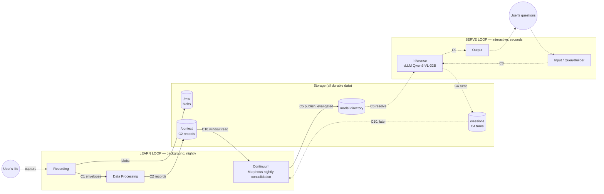
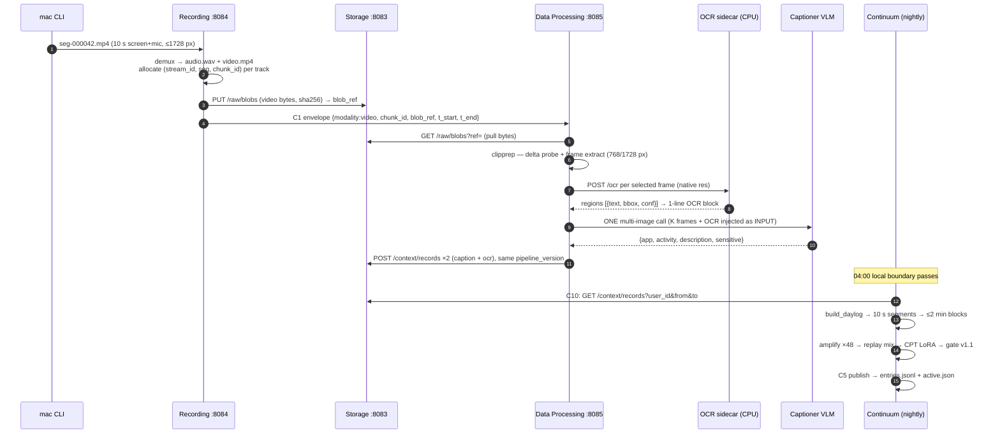

# The Learn Loop, End to End — Onboarding

> The path that turns a pilot user's raw captured life into fine-tuned weights:
> **recording → data-processing → storage → continuum → model directory → (inference serves the adapter)**.
> Written for a co-founder-level newcomer: our system, not general concepts. Every load-bearing
> claim is spot-checked against code; where a document and the code disagree, the code wins and
> the discrepancy is flagged in §8. Companion docs:
> [ARCHITECTURE.md](../ARCHITECTURE.md) (the contract spine's home), each service's `CHARTER.md`
> + `HANDOFF.md`, and the schemas in [contracts/](../contracts/).

**Last verified against code:** 2026-08-07. Where a document and the code disagree, the code
wins and the discrepancy is flagged in §8. Suites: storage *354* · continuum *264* (+7 skipped) ·
recording *144* · data-processing *569* (+4 skipped).

---

## 1. Why the learn loop exists

The product bet is a **personal model that knows your life because it lived it with you**: capture
a user's physical + digital day continuously, process it into timestamped, enriched text records,
and every night distill that day into the user's own LoRA adapter on the shared base model
(Qwen3-VL-32B). The serve loop makes the product usable today; the learn loop is why the product
exists — "the context of a day silently becomes weights overnight"
([ARCHITECTURE.md](../ARCHITECTURE.md) §The two loops).

Two properties define "good" here:

- **Zero silent loss.** A life stream is unrepeatable. The capture path is engineered like a
  bodycam archive pipeline (D14), not a live-view stream: at-least-once delivery, dense sequence
  numbers, blob-first durability, checked continuity verdicts. A lost chunk must be *visible*.
- **The quality ceiling is set in DP.** The trainer never sees pixels or audio — it sees the text
  DP wrote.
- Whatever the captioner, ASR or OCR did not put into a C2 record's `content.text` can never be
  learned, no matter how good the consolidation is.
- That is why DP carries the heaviest design discipline in the company: the stage graph, the
  dialect law, the record-vs-mutation law.
- It is also why nightly training-quality arguments keep resolving back into DP record-shape
  arguments.

The loop was **proven end-to-end on 2026-07-25**: a 32B life adapter trained by our own pipeline
passed the gate, was published via C5, and loaded + answered in vLLM (M0); and the Phase-3 dogfood
pushed 209.7 h of real audio through the actual recording→DP→storage→continuum services and
reproduced the research baseline's learnability (*pipeline sound* — [HANDOFF.md](../HANDOFF.md)
2026-07-25 entry).

---

## 2. The map

### 2a. The two loops, and where the learn loop sits

The learn loop (solid) and serve loop (dashed) share the same stores and the same per-user model.
This document covers the solid path; the serve loop appears only where the adapter lands.



### 2b. The learn-loop service/contract flow (as built)

This is the honest, code-verified version of the flow — including the two places where the
as-built seam differs from the target architecture (dotted): day-log materialization currently
runs *inside* continuum, and the C5 model directory continuum writes is continuum-local, not yet
storage-hosted or wired to inference's C6.

```mermaid
flowchart LR
  subgraph capture["Recording :8084"]
    CLI["mac CLI / phone web / extension<br/>segmented HTTP upload (D14)"]
    DEMUX["demux: 1 segment →<br/>audio.wav + video.mp4 chunks"]
    LED[("continuity ledger<br/>SQLite: streams, sequences,<br/>dp_state, verdicts")]
    CLI --> DEMUX --> LED
  end

  subgraph dp["Data Processing :8085"]
    ING["/ingest (C1 receiver)<br/>durable journal, dedup on chunk_id"]
    SG["stage graph per modality<br/>audio: asr+diarize+acoustic+speaker_align<br/>video: clipprep+screentext+clipcap"]
    ING --> SG
  end

  subgraph storage["Storage :8083"]
    RAW[("/raw")]
    CTX[("/context")]
    SMD[("model_directory table<br/>serves C6 resolve")]
  end

  subgraph continuum["Continuum (nightly, no port)"]
    DLC["DayLogClient (local):<br/>build_daylog → segments → blocks"]
    CYC["run_cycle: recipe · day-log ·<br/>amplify · replay-mix · train ·<br/>gate · publish"]
    CMD[("var/model_directory<br/>entries.jsonl + active.json")]
    DLC --> CYC --> CMD
  end

  INF["Inference :8081/vLLM :8000<br/>serves base; adapter hot-swap NOT wired yet"]

  DEMUX -- "blob-first PUT /raw/blobs" --> RAW
  DEMUX -- "C1 envelope push" --> ING
  SG -- "C2 POST /context/records" --> CTX
  CTX -- "C10 EVOLVED: GET /training/daylog<br/>?user_id&window_id (storage renders)" --> DLC
  CTX -- "C10 legacy range read: GET /context/records<br/>?user_id&from&to (kept — D12 beta feed)" --> DLC
  SMD -- "C6 resolve (base only today)" --> INF
  CMD -. "C5 target: storage-hosted directory<br/>(shape NOT PINNED — D19; consumer is inference)" .-> SMD
  SMD -- "C12 profile: GET /users/{id}/profile<br/>home_tz — scheduling + render fallback" --> DLC
  SMD -- "C13 recipe + gate policy · C14 reservoir" --> DLC
```



### 2c/2d. DP internals and the chunk lifecycle

Rendered inline in §4.2 (DP internals — the modality stage graph and the two video pipelines) and
§5 (a chunk's lifecycle timeline), where the surrounding prose explains each hop.

---

## 3. The contract spine

The contracts are the *only* coupling between services ([ARCHITECTURE.md](../ARCHITECTURE.md)
§Contracts). Changing one means editing ARCHITECTURE.md §Contracts first (ORG rule). The learn
loop rides **eight** of them. Status at a glance:

| Contract | Producer → Consumer | Status | Machine schema |
|---|---|---|---|
| C1 | recording → data-processing (+ blob leg → storage `/raw`) | **v0 pinned** (2026-07-09) | [c1_raw_stream_envelope.v0.json](../contracts/c1_raw_stream_envelope.v0.json) |
| C2 | data-processing → storage `/context` | **v1, live** (D24) | [c2_processed_record.v1.json](../contracts/c2_processed_record.v1.json) |
| C10 | storage → continuum | **v2, live** (D18/D28) — a day-log fetch by `(user_id, window_id)` plus the training-window ledger, over an `updated_at` watermark. The raw range read is *kept*, not retired | [c10_daylog.v2.json](../contracts/c10_daylog.v2.json) · [c10_training_window.v1.json](../contracts/c10_training_window.v1.json) |
| C12 | storage → continuum | **BUILT** — per-user profile; `home_tz` only in v0 | [c12_user_profile.v0.json](../contracts/c12_user_profile.v0.json) |
| C13 | storage → continuum + inference | **BUILT** — recipe registry + the separately-versioned gate policy | [c13_recipe.v0.json](../contracts/c13_recipe.v0.json) · [c13_gate_policy.v0.json](../contracts/c13_gate_policy.v0.json) |
| C14 | continuum ↔ storage | **BUILT** — append-only reservoir ledger; audit/provenance, *not* the replay path | [c14_reservoir_ledger.v0.json](../contracts/c14_reservoir_ledger.v0.json) |
| C5 | continuum → model directory | **built continuum-local; shape not pinned (D19)** — its only consumer is inference via C6, which is not being built | none yet |
| C11 | storage → input (QueryBuilder) | **designed only; zero code** | none yet |

### C1 — the raw-stream envelope (pinned)

Two legs. **Blob leg:** recording `PUT`s the chunk bytes to storage `/raw/blobs` *first*; storage
verifies sha256 + byte count (`storage/app/main.py:108-128`) and mints an opaque `blob_ref`,
deterministic on `(user_id, chunk_id)` so a retry re-mints the same ref
(`storage/app/db.py:206-217`). **Envelope leg:** recording then pushes the JSON envelope to DP's
`/ingest`:

```
{contract:"C1", version:"0", user_id, device_id, stream_id, sequence, chunk_id,
 modality: audio|image|video|text, codec, t_start, t_end (RFC3339 UTC),
 blob_ref, blob_sha256, blob_bytes, device_location?, device_clock?}
```

Why it is shaped this way (all pinned as delivery semantics, not just fields):

- **Push, at-least-once; `chunk_id` is the dedup key** — a client-minted ULID
  (`recording/app/ids.py:27-31`), constant across retries; DP and `/raw` are both idempotent on it.
- **`(stream_id, sequence)` is the loss detector** — `sequence` is dense, zero-based, +1 per chunk
  within a globally-unique `stream_id`; *any* break, including a non-zero first-seen value, is a
  lost chunk. This is the "zero silent loss" mechanism, checked on both sides (recording's ledger
  + DP's break/dup detector).
- **Blob-first invariant** — the blob is durable in `/raw` before the envelope is ever emitted, so
  `blob_ref` cannot dangle at emit (consumers still tolerate a since-deleted blob: deletion is a
  feature).
- One envelope format for all four modalities, so vision/text never reshaped the wire.

### C2 — the processed record (pinned)

What DP writes to `/context` (`POST /context/records`, schema-gated at
`storage/app/main.py:149-162`):

```
{contract:"C2", version:"1", record_id, user_id, modality,
 source:{device_id, stream_id, chunk_id, blob_ref,
         device_tz?, device_utc_offset_minutes?, device_clock?},  ← provenance, verbatim from C1
 t_start, t_end,                                                  ← the time spine
 pipeline_version,
 content:{slots:{<slot_name>:{version, …per-slot fields…}, …}}}
```

The two load-bearing design choices:

- **`record_id` = sha256(`chunk_id` ␀ `pipeline_version`)** — NUL-joined, hex, a blind `/context`
  upsert. Same inputs give a byte-identical id, so a redelivery or reprocess is idempotent.
- Two components are enough because there is exactly **one record per chunk**: no siblings, so
  nothing to tell apart.
- A `pipeline_version` bump *forks* a new record beside the old. That is version-forward
  reprocessing: records are never rewritten in place.
- **`content.slots` is a map**, one producing stage per slot, written once and never edited. A
  reader tells a hole from an honest empty claim from a never-attempted stage using the record
  plus its dialect alone.
- **`pipeline_version` is the dialect** — the statement of *which processing produced this text*.
  Continuum must train on a consistent dialect; storage never filters on it (yet), which is
  exactly why storage keeps `pipeline_version` on every record (§6).

`content` is a **slots map**: one producing stage per slot, written once, never edited. Adding a
slot type is an additive edit to the schema and both pydantic mirrors together. Storage assigns
`created_at` and `updated_at` itself — neither is carried in C2. Per **D17** the timezone comes
from the **capturing device**: `source.device_tz` + `source.device_utc_offset_minutes`,
additive-optional, carried verbatim from C1. Timestamps stay UTC-canonical; the zone rides beside
them. See §8.4.

### C10 — the training-window read

> **In one paragraph.** Continuum does not build the day-log; it issues a warrant
> for one. Storage materializes C2 records into the segment/block day-log and serves it by
> `(user_id, window_id)`, plus a training-window ledger (`POST /training/windows` is an idempotent
> get-or-create) and a window enumeration read. The window itself is `[last_trained_t, now−δ)` on
> **storage's `updated_at`**, not on event time and not on a local date — so storage needs no
> timezone to serve C10, a missed or failed night is absorbed into the next window, and *late data
> cannot exist*, because `updated_at` is assigned at write and can never land below a closed
> boundary. `last_trained_t` advances **if and only if a cycle publishes**. `window_id` is an
> opaque, path-safe, lexicographically-ordered token (`w<YYYYMMDD>T<HHMMSS>Z`) that **no consumer
> may parse**. The decisive argument for moving materialization was replay: it re-reads *prior*
> day-logs nightly, so a continuum-side builder would re-pull every prior day's raw records every
> night — O(days²) to reconstruct what storage could have kept. Full statement:
> [ARCHITECTURE.md](../ARCHITECTURE.md) §Contracts → the *C10 card*.
>
> **The raw range read is NOT retired.** `GET /context/records?user_id=&from=&to=` remains
> first-class — it is D12's beta training feed, the debugging path, and C11-adjacent.

### C5 — the adapter publish (built; shape not pinned)

**As built** (`continuum/app/publish.py:83-99`), the entry appended to the model directory's
per-user `entries.jsonl`:

```
{contract:"C5", user_id, adapter_version, adapter_dir, base_model_hash,
 training_window, recipe_id, eval_report, status: active|gate_failed|rolled_back}
```

plus an atomic `active.json` serving alias. Semantics verified in code:

- **Publish is eval-gated** — a gate-failed candidate is *recorded* (audit trail, `adapter_dir`
  nulled) but never becomes active (`publish.py:101-114`).
- **Rollback is first-class** — the entries log replays into a stack of live activations; rollback
  pops the top and re-points the alias, re-entrant down to base (`publish.py:116-140`, stack
  replay at `publish.py:33-44`).
- **Alias monotonicity** — re-consolidating an old window appends its entry but never moves the
  serving alias backward (`publish.py:92-97`).
- **Snapshot retention** — old adapter *artifacts* are pruned (default 14, sized for rollback and
  the ≤14-night hard-delete replay), entries stay (`publish.py:142-167`).

The module's own header says it plainly: *"C5's v0 shape is NOT pinned yet (needs inference at the
table; founders ratify)"* (`publish.py:3-4`) — hence the directory lives under continuum's
`var_dir/model_directory/` so the storage-hosted swap-in is "a transport change, not a redesign."

**The four short descriptions are fixed — review item O-2, closed 2026-07-26.** They previously read
"version, base-model hash, training window, eval report, status (active/rolled-back)": short by
`adapter_dir` and `recipe_id`, and — the one that mattered, **missing the `gate_failed` status entirely**,
i.e. the audit trail for a blocked candidate, exactly the thing a reader most needs to know exists. All four
now carry the nine fields and the three statuses ([ARCHITECTURE.md](../ARCHITECTURE.md) §Contracts C5 ·
[continuum charter](../services/continuum/CHARTER.md) C5 row · [storage
charter](../services/storage/CHARTER.md) model-directory row · `publish.py`'s own docstring).

**The call the founders took, so you know what you are reading:** this is a description of C5 **as
built, deliberately not a pin** — every site says so in its own text. C5 stays unpinned until the
pinning session with inference at the table; the reasoning was that a known-wrong description should
not stand while waiting for a session with no date, and that describing is not pinning — but the
counter-argument (a field list in ARCHITECTURE §Contracts is how things become de-facto pinned
around here) is answered *inside the wording*, not by withholding it: the "as built, not pinned"
label rides in the same table cell, so the row cannot be quoted without its caveat.

**What `gate_failed` costs at pin time, beyond documentation** — written into the storage
charter's model-directory row, because it lands on storage: storage's `model_directory` table
today is the trivial C6 row (`user_id, model_id, adapter, adapter_path`, `storage/app/db.py:59-63`)
with no entries log and no status column, so hosting C5 is a build, not a transport swap. Three
consequences: `status` must be a **three**-value enum or `record_gate_failure()` has nowhere to
land; `gate_failed` rows carry *NULL `adapter_dir`/`base_model_hash`*, so those columns cannot be
`NOT NULL`; and C6 eligibility is a *log replay* (`active` pushes, `rolled_back` pops,
`gate_failed` does neither) — a "latest row wins" directory would serve a gate-failed candidate,
which is the ungated swap the gate exists to prevent.

### C11 — the recent-context read (designed only)

Bridges "the model only knows up to last night" for same-day questions: a recency/semantic
retrieval over `/context` + `/sessions`, owned by input's QueryBuilder with the index in storage.
**Zero code exists** — `input/app/query_builder.py:6` states "no C8 normalization, no C11
recent-context (those are later slices)". It matters to the learn loop only as the seam that
excuses the nightly cadence; nothing in the learn loop depends on it.

---

## 4. Per-service deep dive

### 4.1 Recording — capture, carve, demux, emit, prove continuity

**Job:** get the user's life onto our backend with zero silent loss, and be the privacy front line
(consent controls — deferred to pre-pilot per D13). It owns the capture clients, the chunking, the
blob upload, the C1 push, and the *proof* that nothing was lost.

**Capture surfaces (all landed, verified `clean` on real hardware 2026-07-19):** three clients
speak one client-agnostic `/capture/*` wire — the **mac CLI**
(`recording/clients/mac/nucleus_capture.py`: ffmpeg avfoundation, screen+mic, 15 fps default,
retina downscale bound `--max-width 1728`, segments of `--segment-seconds` default *10 s*
(`nucleus_capture.py:647`)), the *phone web client* (mic+camera), and the *Chrome MV3
extension* (passive active-tab capture). Transport is *segmented HTTP upload* for all surfaces
(D14): the loss-intolerant archive pattern, not low-latency live-view.

**Server pipeline per segment** (`recording/app/emitter.py:182-225`):

1. **Demux** (`recording/app/demux.py:67-106`): ffprobe decides which tracks exist (a `video/*`
   mime can be audio-only), then one segment splits into per-modality chunk files — audio
   re-encoded to 16 kHz mono s16le WAV (faster-whisper's native shape), video *container-copied*
   (no re-encode; mp4 gets `+faststart`).
   - This is why one mac screen segment becomes *two C1 chunks on two streams* (audio + video).
2. **Allocate-then-emit** (`emitter.py:247-274`): every track's chunk identity (stream row,
   `sequence`, ULID `chunk_id`) is allocated in the SQLite ledger *before* any emission, so a
   mid-emit failure can never make a retry mint out-of-order sequences.
3. **Blob-first, then envelope** (`emitter.py:276-296`): `PUT /raw/blobs` (sha256-checked by
   storage), then the C1 envelope push to DP `/ingest`. Both demuxed chunks carry the *segment's*
   wall-clock span.

**Continuity — the checked "zero silent loss":** the ledger tracks every segment/stream/chunk and
each chunk's `dp_state ∈ {NULL(unemitted), accepted, processed}` (`recording/app/ledger.py:76`).
The two-leg gap report renders a verdict `clean | gaps | recording`; `clean` means *every chunk
confirmed processed by DP*, and the D16 invariant holds: `dp_acked == "C2 durably written"`. Under
async ingest, DP's 202-accepted chunks sit as `accepted` (verdict `recording`, never falsely
`clean`) until confirmed; the **re-drive path** re-pushes the original envelope — DP's dedup makes
it safe, a done-claim returns `200 {record_ids}` and the chunk is confirmed
(`emitter.py:137-179`, `ledger.py:468-486`).

**State:** alpha complete + async seam + `/metrics` (133 tests). Open: **E-1** (segment-seconds
10→60 — the single largest cost lever, 5.8× on video GPU; joint call with DP-audio since demux
moves both legs), *E-6* (a DP 503 becomes a terminal `failed` segment in 1.5 s of retries,
recoverable only by manual `/retry`), consent gate (D13), streaming-transport leg (D14, deferred
additive).

### 4.2 Data Processing — C1 → C2; the quality ceiling

**Job:** turn raw chunks into the timestamped text records the trainer will see. Audio →
denoise/diarize/ASR/translate; video → captions + on-screen text; one pipeline that will also
serve interactive requests via C8 (same normalization, two entry points — C8 not yet built).

#### Ingest spine

`POST /ingest` schema-gates the C1 envelope, resolves the chunk's `pipeline_version` before any
stage runs, and claims the chunk by `chunk_id`. A **durable journal** (`app/journal.py`) records
an accept *before* the 202 goes out and re-drives every still-pending row at startup, so a
`kill -9` loses nothing. The same journal holds the done-ledger: one row per chunk whose C2 is
durably written, carrying its per-stage status and heal bookkeeping.

A redelivery is judged from that row alone, never from a storage read, and lands on one of five
verdicts: **fresh** (never seen), **skip** (same dialect, all green), **heal** (same dialect, but
the record has holes — re-run and re-POST the same `record_id`), **version-forward** (a new
dialect forks a new record beside the old), or **in-flight** (re-ACK the 202). Async is the
fleet's operating default; the inline path stays byte-identical and is C8's skeleton.

A chunk that can never produce a record dead-letters visibly, so recording's gap report can see
it. There is no per-chunk subprocess shield, because models no longer run inside this process.

#### The stage graph

A **stage is one drop-in file** under `app/stages/<modality>/`, decorated with `@register_stage`.
The declaration is the contract surface: name, modality, stage version `vS`, backend (name + `vB`,
resolved in code), `needs`, the one `slot` it writes, whether it is `required`, a byte budget, and
a named consumer. The executor resolves the graph into a DAG before anything runs, then runs
independent stages concurrently and commits each slot on success.

The invariants hold by construction rather than by policy — this is the Slot Law (L1–L12, the DP
charter's §Slot Law):

- **One record per chunk** (L2). The executor structurally emits one; there is nothing to tell
  siblings apart because there are no siblings.
- **One producer per slot, written once, never edited** (L5). No stage can reach another stage's
  slot, so there is no in-place mutation to police.
- **Identity is carried by code, never by config** (L4). `pipeline_version` is the sorted
  `+`-join of every enabled stage's `<stage>.v<S>-<backend>.v<B>` string, and no environment
  variable may move an output byte.
- **A failure is a hole, not a lie** (L7/L11). A required stage's failure fails the chunk; an
  optional stage's failure leaves its slot absent, and the record still ships. A reader tells the
  three cases apart from the record plus its dialect: stage named in the dialect and slot absent
  means attempted and failed; slot present but empty means an honest empty claim; stage not in
  the dialect means never attempted.

#### Models are servers, not libraries

No model loads inside the DP process. Each runs as a long-lived, replicated, health-checked
server — `servers/whisper`, `pyannote`, `ast`, `ocr`, each in its own venv on its own port, plus
the Qwen3-VL captioner on `:8161`. A stage is a thin client: prepare the request, call the
server, post-process the reply into its slot.

The supervisor that spawns and restarts those replicas runs **inside** the DP process, so DP is
the parent of all eight. A graceful stop takes the fleet with it; a `kill -9` on DP leaves eight
orphans holding their ports and GPU memory.

Before a replica serves its first call, its `/health` identity must match what
`servers/manifest.json` expects. A mismatch is loud and immediate — a stage must never talk to
the wrong model.

#### Dialect discipline: the prompt pack

The video captioner's prompts are a versioned pack on disk. Their aggregate digest is computed at
import and pinned as a code constant in the `clipcap` stage; registration fails loudly if the two
disagree. So editing a `.prompt.md` without bumping the stage's backend version is impossible to
ship silently — the prompt bytes are part of the dialect, exactly like a model revision.

**State:** built and live — 569 tests (+4 skipped), audio and video both running end to end
against the real fleet. Audio M1's exit is still open (no denoise stage; WER/DER baseline
unmeasured). Image and text pipelines (M2) wait until a producing surface exists (D15).

### 4.3 Storage — the durable custody

**Job:** ALL durable stores — `/raw`, `/context`, `/sessions`, model directory. No service keeps
its own durable user data (ownership split, ARCHITECTURE §Ownership). One FastAPI app
(`storage/app/main.py`) over SQLite + a file blob store.

- `/raw` (`main.py:98-145`, `db.py:226-287`): `PUT /raw/blobs` verifies sha256 and byte count
  against what recording declared, mints the deterministic `blob_ref` (path-traversal-guarded
  resolution, `db.py:218-225`), idempotent on `chunk_id`. `GET /raw/blobs?ref=` returns bytes; 404
  covers unknown *and* since-deleted (deletion is contractual).
- `/context` (`main.py:149-183`): schema-gate C2 (authoritative JSON Schema + pydantic mirror
  check), persist verbatim, blind upsert on `record_id`, time-indexed `(user_id, t_start)`. The
  range read `GET /context/records?user_id=&from=&to=` is half-open `[from,to)` ordered
  `t_start ASC, rowid ASC` (`db.py:330-355`) — today's C10.
- **Model directory** (`db.py:176-202`): a table seeded with the base entry
  (`Qwen/Qwen3-VL-32B-Instruct`, adapter `base`, `adapter_path` null — `db.py:44-46`); `resolve`
  returns a per-user override row if present, else base. This is C6's server; it is *not* where
  continuum publishes today (§4.4, §8).

**Retraction** is built and live as a whole-record operation: `DELETE /context/records` keys on
`record_id` / `chunk_id` / `pipeline_version`, with a dry-run manifest and a day-log cascade.
One record per chunk is what makes it expressible in one sentence — there is no finer unit to
delete. The remaining legs are Platform's orchestration and the reservoir cascade (E-2, §6).

**State:** v0.0 + capture M0, built + integrated (26 tests). Deliberately thin — by design the
last unexpanded learn-loop service; its expansion is the named next founders' act.

### 4.4 Continuum — the nightly consolidation ("Morpheus") and the gate

**Job:** the magic. Fetch the day, amplify it into a training corpus, continue the user's one life
adapter by CPT, gate it, publish it. Reimplemented cleanly from the research consolidation line
(`b3c58e1`) and **parity-proven** by a differential harness (`render_block` byte-identical, LoRA
target set 252/252 exact, judge exact, ensemble indistinguishable at n=8/10, p=0.82 —
`handoff/ws-morpheus-port.md`).

**The lean loop** (`app/cycle.py:121-296`) — every data-shaped input arrives through a storage
*client seam* (local today, HTTP-to-storage after ratification; the cycle unchanged), every stage
journaled under a content-hash key so a re-run is idempotent and an unchanged night replays its
recorded outcome with zero side effects:

1. **fetch recipe (+ policy)** — `LocalRecipeRegistry` resolves ids to `recipes/<id>.json` /
   `policies/<id>.json` (`app/clients/registry.py`).
   - Recipe v1.0: 48× amplification variants, 15 % deny-then-correct negatives, LoRA r128/α256, lr
     1e-4, 3 epochs, 1024-token chunks, next-token CPT (never QA-SFT), 30 % replay,
     `segment_seconds=10`, `block_segments=12`, day boundary 04:00 local.
   - The *gate policy is a separate artifact* whose id never enters a stage key
     (`app/policy.py:1-24`): re-deciding what is shippable must never re-train anything.
2. **fetch day-log** — `daylog_client.fetch_daylog(win)`; §4.5 below for the join. Cache key =
   content hash of the *rendered* day-log (`cycle.py:161-171`).
3. **amplify** — `MorpheusBackend.amplify` (`app/backends/morpheus.py:60-72`): each eligible block
   is retold ~48× by a generator model under the profile's prompt, which mandates *"keep every
   exact color, number, name, and on-screen/world text verbatim.
   - Do not invent"* (`app/morpheus/profiles/speed.py:59-66`), plus 15 % negation-style
     calibration variants.
   - An `ok_rate` below the recipe floor *aborts the night* (serve stale adapter, consolidation
     debt — `cycle.py:188-191`).
4. **replay mix** — anti-forgetting: ~30 % prior-night material sampled from the *reservoir*
   (the permanent store of every gate-passed night's corpus; admission at `cycle.py:280`), keyed
   so a re-consolidated past day invalidates tonight's mix (`cycle.py:199-227`).
5. **train** — continue the *one life adapter*: resume from the newest still-live activation for
   an earlier window (`publish.py:65-74`), CPT on the mixed corpus (`morpheus.py:74-108`).
   - `adapter_version` = `a-` + sha12 of (corpus, recipe_id, MORPHEUS_VERSION, resume lineage) —
     content-derived, never a path (`morpheus.py:34-38`).
   - LoRA targets every `nn.Linear` named `{q,k,v,o,gate,up,down}_proj` inside the
     `language_model` scope, with vision towers deliberately excluded — 252 modules,
     parity-checked (`morpheus/train.py:29-31,89-100`).
   - The C5 `base_model_hash` is today a hardcoded label `"qwen3-vl-32b-instruct"`, not a real hash
   (`cycle.py:43` — "pinned for real once D6's exact variant lands"); 32B training needs ≥2 H100s
   (measured hard limit, M0, `MORPHEUS_SHARD_GPUS`).
6. **gate** — §below. 7. *publish* — C5 (§3), pass → reservoir admission; fail → recorded
   candidate + a strike; *2 consecutive newest-window failures freeze the user's consolidation*
   until a human clears it (window-monotonic strikes, `cycle.py:87-118`).

**The gate — policy v1.1** (`policies/gate-policy-v1.1.json`, ratified 2026-07-24 from measured
distributions; enforcement `app/gate.py:33-72`). Four wired checks, three declared-skipped
(`decay_spot_check`, `general_canary`, `read_skill_canary`) so nobody mistakes a 4-check pass for
a 6-check pass:

| Check | Threshold | Note |
|---|---|---|
| new-day recall | ≥ 0.15 | judge-exact on day probes |
| traps pass-rate | ≥ 0.15 | scored offline (marker match) so calibration stays measurable when the judge API is down; raise to 0.25 when the suite reaches ~150 probes |
| heldout contamination | one-sided Fisher exact vs **the run's own base control**, α=0.01, + absolute backstop 0.15 | a fixed ceiling can't tell a leak from a knowledgeable base and breaks the day the base changes (`app/policy.py:64-79`) |
| min probes | ≥ 148 | the policy JSON's note ("the harness supplies exactly 60+60+28") is stale: `evaluate` now loads **all 222** heldout probes + up to 50 traps (`morpheus.py:124-129`), so a single-day night supplies ~332 |

Eval mechanics (`morpheus.py:110-167`): probe/corpus **generator independence is asserted before
any generation** (a score is only evidence if the questions weren't written by the model that
wrote the prose); the judge is Gemini-2.5-flash on Vertex; the base control runs the same heldout
probes through `adapter.base_only()`.

**Proof points (2026-07-25):** **M0** — a 32B adapter our pipeline trained → gate → C5 → loaded in
vLLM and answered (recall 0.267). *Phase-3 dogfood* — 209.7 h of real Speed audio (629 chunks)
replayed through the actual recording→DP→storage→continuum services (a replay `ChunkSource` + an
injected-caption DP sidecar; no contract changes); the decomposition run with parity block content
reproduced the baseline separation (0.137 vs 0.179, permutation p=0.148, same distribution;
p=0.018 above the no-consolidation control). *Verdict: the real services carry the learn loop
without losing learnability.*

**State:** 185 tests passing (+7 skipped). Open: the storage/C10 board ratification; the
**recipe/dose finding** (amplification dose is fixed per block, but recall depends on retellings
per unit of text — at our native cadence dose must scale with block-text volume; for Gnandeep);
the *E-4* renderer asks (per-fragment local timestamps in `_render_block`, *without them "at
13:04 the user was writing an email about X" is structurally unreachable no matter what DP
emits*, since the only clock a trainer ever sees is the block anchor, `app/daylog.py:156-158`;
OCR dedup; renderer ordering; a recipe fork to `segment_seconds=60`); the failed-day merge (fold
day N into night N+1) tracked as debt, not wired.

### 4.5 The day-log — storage materializes it, continuum is the parity reference

> **The heading is as-written-then and the body is corrected.** Since **2026-07-27** the day-log
> is **storage's**: `storage/app/daylog.py` materializes it, and `continuum/app/daylog.py` survives
> as the **parity reference** that storage's `materialize_daylog` is diffed against (storage
> CHARTER M9). The construction rules below are true of both, because that is what the diff proves.
> Verified against the code 2026-07-28.

The day-log is **the only interface between ingest and consolidation** (the research design's
pinned-schema rule — `continuum/app/daylog.py:1-8`). How `/context` records become training blocks:

- **Window** = `[last_trained_t, now−δ)` on *storage's `updated_at` axis*, not a local day.
  `window_id` is an opaque `w<YYYYMMDD>T<HHMMSS>Z` derived from the window's *end* instant, minted
  in exactly one place and parsed by nobody.
- Storage owns the per-user watermark and mints the window durably and idempotently, so a retry
  gets the *same* window back. Continuum fetches; it does not derive.
- Continuum derives no window and no zone of its own: the window comes from storage and the
  zone from the C12 profile read.
- **`home_tz` survives with a narrowed job:** it is a *render fallback* only — the zone a block is
  written in when no contributing record carried a `device_tz`. That is D17's fact/policy split;
  the record's own zone wins, because it is a fact about where the user physically was.
- **Membership is by `updated_at`; bucketing is by `t_start`**, and the bucket grid is *global,
  not window-relative* (`continuum/app/daylog.py:15-22`, adopted 2026-07-27).
- A window-relative grid made the M9 diff true only for a window whose origin happened to sit on a
  segment boundary, and real windows are second-granular, so nine origins in ten are misaligned.
- **Segments**: every C2 record in the window lands in a `segment_seconds` (10 s) bucket by its
  `t_start`. Routing is by slot: `slots.transcript` → the `asr` channel — with *diarized sub-spans
  placed by their own `t_start`*, so a VAD chunk straddling the boundary can't drag in-window
  speech out; `slots.ocr` → the `ocr` channel; `slots.caption` → the `caption` channel. When
  `slots.transcript` is absent, speech falls back to `slots.asr` with speakers unlabeled.
- **One dialect per record, latest `updated_at` wins**, keyed `(chunk_id)` with a rowid tiebreak.
  One record per chunk leaves nothing finer to key on.
- It keys on `updated_at` because `pipeline_version` is a *composed* string and not orderable,
  where the store's own clock is.
- **Blocks**: runs of ≤ `block_segments` (12) temporally-adjacent non-empty segments; a gap >
  6×segment_seconds (60 s — camera-off) starts a new block so one anchor line never spans hours of
  silence (`daylog.py:125-139`).
- **Rendering** (`daylog.py`): one text per block, labeled lines in the *wearer's timezone* —
  resolved per block by `_block_zone()`: the *capturing device's* `device_tz` wins (so a day spent
  in another zone renders honestly), falling back to the window's `home_tz`, and degrading rather
  than raising on an unresolvable id (§8.4/D17) —

  ```
  On 2026-07-21, around 13:02–13:04 local time:
  Scene: <all captions, space-joined>
  Heard: <spk: text | ...>
  World text (OCR): <ocr | ...>
  ```

  `anchors={date, place:None}`; block quality = min of scored segments (C2 v0 has no quality
  field, so everything passes the `quality_min` gate today, `daylog.py:175-180`).

This rendered text is what the amplifier retells 48× and the adapter trains on. Two consequences a
co-founder should hold: **block characters are the training currency** (Phase-3 measured acquisition
falling 3.2× for a 3.7× rise in chars/block — the reason DP's chars-per-second budget D-11 is a
*correctness* knob), and **ordinal truncation is a real hazard** (the amplifier reads
`block.text[:6000]`; OCR renders last; at legacy caption volumes 100 % of the OCR channel was
silently truncated away, the clip budget keeps blocks at ~3.3 k chars; renderer reorder is E-4(c)).

### 4.6 Inference — the learn-loop tail

**Job here:** serve the adapter the learn loop publishes. As built: inference resolves C6 per request against storage (`inference/app/storage_client.py:28-43`,
graceful fallback to base) and streams from vLLM — but the vLLM call sends only `model: settings.model_id`, **no adapter/LoRA parameter**
(`inference/app/backends/vllm.py:17-40`), and `serve_vllm.sh` launches text-only with the multimodal knobs intentionally omitted (`serve_vllm.sh:52`). So today: C6
resolves base for everyone (storage's directory is seeded base; per-user override rows exist as a mechanism but nothing writes them), and per-user LoRA hot-swap on
request boundaries is the *designed, not yet wired* tail. Continuum's M0 proved the artifact side of it — a 32B r128/α256 adapter of our exact recipe shape loads and
answers in vLLM (the earlier failure was KV-cache budgeting, not LoRA incompatibility, `continuum/handoff/ws-morpheus-port.md`), but that serving proof ran through
continuum's own offline `vllm.LLM(enable_lora=True)` smoke (`continuum/scripts/vllm_load_check.py`), never through the inference service; inference's `/infer` handler
drops `adapter_path` on the floor after resolve (`inference/app/main.py:74-76`). Closing C5→model directory→C6→vLLM-hot-swap as one wired path is exactly what the
pending C5 shape pin ("needs inference at the table") is for.

### 4.7 Platform — the substrate (where it matters here)

Platform owns the fleet bring-up (`run_learn.sh` starts storage :8083 · DP :8085 · recording :8084,
health-gated, in that order; the cloudflared capture tunnel is *not* part of it — that is
recording's own `run_tunnel.sh`), the D9 observability backbone (one shared Prometheus + Grafana;
services emit `/metrics` + own dashboards, DP and recording already emit), consent policy custody
(D13, deferred), deletion orchestration, and the unresolved **GPU allocation policy** that E-3(b)
forces: today DP's captioner URL and inference's serving URL both default to the *same*
Qwen3-VL-32B instance on node-7, and DP's nightly prefill bursts would sit in the same continuous
batch as a user's chat decode. Note the running node-7 fleet predates the three DP merges — restart
pending (behavior unchanged; knobs off by default).

---

## 5. A chunk's journey — one mac screen-recording segment, capture → adapter

The concrete data shapes at every hop, for the **video path** (the
gated-off target path — under today's default the same journey emits ~4 keyframe captions at step
5 instead of 2 records).



**Hop by hop:**

1. **Capture.** The mac CLI records screen+mic via ffmpeg avfoundation into 10 s segments
   (`nucleus_capture.py:647`), uploading each over the `/capture/*` wire.
2. **Demux + identity.** The segment splits into `audio.wav` (16 kHz mono) and `video.mp4`
   (container copy) (`demux.py:87-104`).
   - Recording mints/gets one *stream per (session, modality)* and allocates each track the next
     dense `sequence` plus a fresh ULID `chunk_id` — *before* emitting anything
     (`emitter.py:247-274`).
   - One segment → *two chunks on two streams*; both carry the segment's wall-clock
     `t_start/t_end`.
3. **Blob-first.** Video bytes `PUT` to `/raw/blobs`; storage verifies sha256, mints
   `blob_ref = sha256(user_id␀chunk_id)`-style opaque ref, idempotent (`db.py:206-217`,
   `main.py:108-128`).
4. **C1 push.** The envelope goes to DP `/ingest`. DP schema-gates it, computes the video
   dialect at accept, claims `chunk_id` (journal receipt), and the ledger row on recording's side
   moves to `accepted`/`processed` per D16.
5. **The clip stages** (the audio sibling runs its own graph → 1 transcript record):
   - `clipprep` (order 5): pass A probes change every 2 s (32×32 binarized area-max cells: idle
     floor = 2, typing 11–19, app switch 255); pass B extracts K = clamp(⌈span/2.5⌉, 2, 12) frames
     at true PTS, split-scaled to 768 px (caption) and 1728 px (OCR).
   - Slots: `clip_frames`, `delta`.
   - `screentext` (order 15): OCRs the changed/floor frames at native res through the sidecar
     (`POST /ocr` → `[(text, bbox, conf)]`), then confidence-gate (≥0.60), reading-order sort +
     **region role words** (`titlebar|compose|main|…` — the useful 80 % of geometry at zero
     contract cost; the bbox is then discarded), min-chars, *deterministic secret redaction*
     (AWS/sk-/ghp_/PEM/Luhn shapes → `[redacted:secret]`), within-chunk dedup, budget → one
     single-line block.
   - Writes the `ocr` slot.
   - `clipcap` (order 20, primary): ONE multi-image chat call — interleaved time-labelled frames,
     the OCR block injected under *"On-screen text (read by a specialist pass, input, not
     target)"*, rules forbidding invention; guided-JSON reply parsed to `ClipDesc{app, activity,
     description, sensitive}`; writes the `caption` slot.
6. **Exactly one C2 record**, carrying the C1 span verbatim and stamped with the composed dialect
   — the `caption` and `ocr` slots sit inside it, side by side.
   - The dialect on a video chunk today is
     `clipcap.v1-vlm.v2+clipprep.v1-ffmpeg.v1+screentext.v1-ppocr.v1`: every enabled stage's
     `<stage>.v<S>-<backend>.v<B>` segment, sorted and `+`-joined.
   - `record_id = sha256(chunk_id ␀ pipeline_version)`, and `POST /context/records` upserts it
     idempotently (`storage/app/main.py:149-162`).
7. **Day-log.** When the window closes, storage materializes it: the record's `caption` and `ocr`
   slots land, by `t_start`, in one 10 s segment's `caption`/`ocr` channels, and an audio chunk's
   `transcript` slot in `asr`.
   - Up to 12 consecutive non-empty segments render into one ~2-min block:
     `On 2026-07-21, around 13:02–13:04 local time: / Scene: … / Heard: … / World text (OCR): …`
     (`daylog.py:144-172`). Continuum fetches the rendered result over C10.
8. **Consolidation corpus.** Each eligible block is retold ~48× (facts + on-screen text verbatim,
   no invention) + 15 % negation calibration; ~30 % replay from prior nights' reservoir corpora is
   mixed in (`cycle.py:179-227`).
9. **CPT.** The user's one life adapter is *continued* (resumed from the newest live activation)
   — LoRA r128/α256 over the LLM linears, 3 epochs on 1024-token chunks at lr 1e-4, on the pinned
   32B base (`morpheus.py:74-108`, `cycle.py:229-246`).
10. **Gate → C5.** Policy v1.1's four checks run against judge-scored probes with a same-run base
    control.
    - On pass, a `{contract:"C5", adapter_version:"a-…", adapter_dir, base_model_hash,
      training_window:"w20260721T110000Z", recipe_id, eval_report, status:"active"}` row appends to
      `entries.jsonl`, `active.json` flips forward-only, and the night's corpus is admitted to the
      reservoir.
    - **Since 2026-07-27 that whole tail is idempotent**: `publish()` keeps at most one live
      activation per `training_window`, superseding rather than stacking, and a reservoir conflict
      is non-fatal.
    - Before that, a mid-tail failure left two `active` rows for one window and a `rollback()` that
      flipped the alias to the *same* adapter — the only safety net a bad adapter has, silently
      dead.
    - On fail: a recorded candidate, a strike (**once per window**, however often it is
      re-consolidated), and a freeze at 2.
    - The chunk's ten seconds of screen life are now weights, and tomorrow's serve loop *will* pick
      that adapter up once the C5→C6 wiring lands (§4.6).

---

## 6. State of the world

### Built + integrated (proven end-to-end)

| Piece | Evidence |
|---|---|
| Capture M1 + 3 real clients (mac CLI / phone web / extension), checked continuity | verified `clean` on real hardware 2026-07-19; 133 recording tests |
| DP: one C2 record per chunk from `content.slots`, durable journal with heal-on-redrive, models as supervised servers | 569 tests (+4 skipped); audio and video both live against the real fleet |
| DP screen-video path (clipprep → screentext → clipcap, versioned prompt pack, eval harness) | built and live; `caption` and `ocr` slots on every video record |
| Storage v0.0: /raw, /context, /sessions, C6 resolve | integrated since 2026-07-09 |
| **Storage D18 expansion (2026-07-27): C12 profile · training-window ledger + the sole `window_id` minter · day-log materialization (C10 evolved) · C13 registry · C14 reservoir** | **310 tests.** The day-log storage renders is proven *byte-identical* to continuum's over *two window origins including a misaligned one* (`storage/scripts/daylog_parity_diff.py`, 31 binding checks) |
| Continuum consumes storage's HTTP surface | **264 tests** (+7 skipped). The window comes from storage and the zone from the C12 profile read; continuum derives neither |
| **The seam proven live, two processes over HTTP** | `continuum/scripts/seam_check.py` — 10 steps, 152 checks, 0 blockers. Plus a real fleet run: capture → faster-whisper → `/context` → a nightly to **published**, with the watermark advancing only on publish and exactly one active C5 row |
| Continuum: Morpheus port (parity-proven) + lean cycle + gate v1.1 + C5 publish/rollback + reservoir | M0 met (32B adapter → gate → C5 → vLLM); 185 tests |
| Phase-3 dogfood: real data through the real services reproduces baseline learnability | *pipeline sOUND (p=0.018 vs no-consolidation control) |
| Serve loop v0.0 on real Qwen3-VL-32B (the learn loop's landing zone) | closed 2026-07-09 |

### Gated (built, but a named gate stands before "live")

| Gate | What it holds back | What clears it |
|---|---|---|
| **O-2** — real-frame OCR bar | the OCR bar is measured on synthetic frames, not real ones | PP-OCR cleared a 204-frame *synthetic* macOS proxy (recall 0.988, CER 0.070 @1728 px) but the gate is defined over ~200 hand-labelled **real** frames; re-run the same harness on a real capture (≥0.85 recall, ≤0.10 CER). Engine shipped is PP-OCRv4, design named v6 (flagged L-3) |
| **O-8** — blind-vs-injected A/B | the OCR→caption *injection* architecture (A) vs the minimal-hint fallback (D) | pre-registered rule: ship A iff entity-recall gain > 0.25 AND corrupted-OCR propagation < 0.10; needs a real VLM endpoint → E-3 |
| **E-2** — the remaining retraction legs | whole-record retraction is live; Platform's orchestration and the reservoir cascade are not | Platform M2 + the cascade leg |
| **C5 shape pin** — *deferred on purpose (D19)*, since its only consumer is inference via C6 and inference is not being built. Free to defer *because* C5 is unpinned: D18 changed `training_window`'s format at no cost. One standing rule for whoever pins it — *pin `training_window` as an opaque token, never as a date*, or the parsing D18 deleted grows back | the wired C5 → storage model directory → C6 → vLLM per-user hot-swap tail | a founders' ratification "with inference at the table"; publish.py is deliberately transport-swappable |

### Designed / open (no code, or explicitly deferred)

- **C11** recent-context read (`input/app/query_builder.py:6`), *C8* shared sync pipeline — serve-loop-side slices.
- DP **M1 exit** (denoise stage + WER/DER baseline) open; *M2 image/text* pipelines deferred until a producing surface exists (D15).
- Gate's 3 unwired checks (decay spot-check, general canary, read-skill canary) — declared *skipped* in every report.
- Consent gate + deletion orchestration (D13 — before any non-team pilot user); wearable capture client; streaming-transport leg (D14).
- Per-user LoRA hot-swap in inference's request path (§4.6).
- Failed-day merge (fold a failed night into N+1's corpus) — tracked as debt in continuum state.

### Open escalations (founders' board, [HANDOFF.md](../HANDOFF.md) §Escalations · DP §10)

| # | Ask | Why it's open |
|---|---|---|
| **E-5** | Parked additive C2 edit (an OCR-geometry slot or field + root `quality{}`) — the ask is to **NOT take it** | both fields would have zero readers today; the diff is written and parked for the first real consumer |
| **E-2** | The remaining retraction legs: Platform orchestration + the reservoir cascade | whole-record retraction is built and live; these two legs are not |
| **E-1** | recording `--segment-seconds 10→60` | 5.8× GPU cost lever + the only route to a caption that reasons across a task step; moves the audio leg too → joint recording+DP-audio call |
| **E-4** | continuum: per-fragment local timestamps in `_render_block` (+OCR dedup, renderer order, recipe fork) | without (a), time-of-day-grounded recall is structurally unreachable. **Premise dissolved 2026-07-26 (D17): the timezone was never the blocker, and C1 now carries one anyway.** Each ASR fragment's own UTC time is already in the day-log (`daylog.py:110,116` write `"t": sub["t_start"]`) and `_render_block` ignores it; the zone to render it in is now resolved per record. E-4 is a *continuum-only renderer change, available today* — no contract, no DP work. Residual: `seg.ocr`/`seg.caption` are bare strings with no `t`, so per-fragment times cover ASR fragments only until the day-log carries times for the other kinds (still continuum-side) |
| **E-6** | recording auto-retry of `failed` segments | a recoverable 503 becomes terminal capture loss in 1.5 s; matters more once GPU unavailability is a *scheduled* nightly event |
| Recipe/dose finding | amplification dose fixed per block vs recall ∝ retellings per unit text | for Gnandeep; at native cadence dose must scale with block-text volume |

---

## 7. The decisions that shaped it

The handful of choices to internalize to reason about this system.

**Why it's this way** — each entry is decision, then alternative, then why.

> **Added 2026-07-27 (D18 · D19 · D20) — four choices that reshaped the storage↔continuum seam:**
>
> **A. The day-log is storage's, and the reason is replay.** Alternative: keep building it in
> continuum, where it already worked and was parity-proven. Why not: replay re-reads *prior*
> day-logs every night, so a continuum-side builder re-pulls every prior day's raw records nightly —
> **O(days²)** across the wire to reconstruct an artifact storage could simply have kept. The general
> rule that fell out is worth more than the move: **storage owns the day-log's REPRESENTATION
> outright; its CONTENT is a contract neither service may move alone** — *if the trainer can see it,
> it is contract; if only storage can see it, it is storage's*. Block text is the training corpus, so
> re-shaping an anchor line silently changes what the model learns and makes every prior measurement
> incomparable.
>
> **B. The cycle window watermarks on the store's own clock, not event time.** Alternative: a local-date
> window, which is what ran. Why: it *dissolves* the late-data problem rather than handling it —
> `updated_at` is assigned at write, so a record can never land below a closed boundary, and a
> phone offline for three days simply trains on Friday in a block anchored to Tuesday. It also
> retires the 23h/25h-day and dateline pathologies, and storage needs **no timezone at all** to
> serve C10. `last_trained_t` advances **iff a cycle publishes**, which makes the research design's
> failed-day merge structural instead of bookkeeping.
>
> **C. `window_id` is opaque, and meaning is minted rather than parsed.** Alternative: keep
> `w<local-date>`. Why not: under a watermark window there *is* no local date to name — a window can
> span 23 h, 25 h, or 47 h after a missed night — so keeping the old format would mean synthesising a
> date purely to name a window, reintroducing the timezone the query just proved it never needed.
> One minter, one validator, and **no consumer may parse it**.
>
> **D. The stage is PROTOTYPE, and the docs say so (D19).** Alternative: keep writing in the
> production voice every canvas already used. Why: a newcomer read those charters as commitments and
> built for durability we have not earned. The banner licenses re-cutting contracts and wiping data;
> it explicitly does **not** license skipping ORG's contract-edit order, leaving a decision
> unrecorded, or **calling a thing BUILT when it is DECIDED**. That last clause caught two false
> claims of my own during this very slice.

1. **Learn and serve are two loops over shared stores and one per-user model.** Alternative: RAG
   over a context store, or live training. Why: the bet *is* weights ("the model knows
   yesterday"); nightly cadence + eval gates is the only shape that survives the POC forgetting
   results. Never trained live into serving.
2. **Contracts before fan-out; the spine is pinned JSON Schema.** Alternative: shared libraries /
   informal seams. Why: parallel agent sessions can only build safely against pinned wire shapes;
   C1/C2 interoperated first-try across four independently-built services at M0 ("zero seam
   fixes").
3. **C1 is two legs, push, blob-first, dense sequences.** Alternative: streaming ingest
   (WebSocket/RTSP), or metadata-with-bytes. Why (D11/D14): capture is the loss-intolerant archive
   job — segmented HTTP + at-least-once + `chunk_id` dedup + `(stream_id, sequence)` gap math give
   checkable zero-silent-loss; a blob that lands before its envelope can never dangle.
4. **`record_id` is deterministic on `(chunk_id, pipeline_version)`; the dialect is
   the version.** Alternative: random ids + in-place updates. Why: redelivery must be an upsert,
   not a duplicate; reprocessing must *fork*, never overwrite, because `content.text` is training
   data — a silently rewritten target is invisible to every diff (the "silent overwrite" class DP
   killed structurally).
5. **Dialect = content digest, not a hand-bumped constant** (prompt pack `PACK_DIGEST` +
   `cfg_tag` allowlist). Alternative: `PIPELINE_VERSION = "v1"` constants bumped by discipline.
   Why: the corpus must fork when and only when model-facing bytes change; humans forget bumps,
   and forking on a DNS change would self-inflict double-counting. The allowlist is
   closed-by-test: a new knob *cannot* ship unclassified.
6. **The record-vs-mutation law.** Alternative: emit whatever seems useful per stage. Why: records
   are placement+label+loss units the day-log consumes; an unprincipled record set produces
   unstable identities (survivor ordinals, decoder-dependent counts) and unreadable blocks. The
   law is executable (CI + registration-time raises), not prose.
7. **OCR decoupled from the BWM and from the captioner — CPU specialist, injected as input** (D8,
   D-06…D-09).
   - Alternative: let the 32B read pixels (POC measured Qwen3-VL OCR at 0.143 vs 0.857/1.000 for
     alternatives — and 3.1×-to-73× the GPU cost), or keep OCR out of the captioner entirely (fuse
     at consolidation).
   - Why: the nightly loop's only model is *instructed not to fuse* — so string→action binding
     ("wrote to Sarah about the Q3 deck") must be written *once, at caption time*, where
     pixels+PTS+regions live; and OCR text in its own slot keeps a
     machine-checkable, independently-filterable channel.
   - The injection premise is
   honest enough to be *measured* (O-8) rather than argued.
8. **One code path for stream + interactive (C8).** Alternative: a separate interactive
   normalizer. Why: a user's typed/snapped request must be normalized *identically* to their life
   stream, or serve-time and learn-time diverge into two dialects of the same person. C8 is
   pinned, unbuilt; DP's inline sync path is deliberately kept as its skeleton.
9. **Day-log as the ingest↔consolidation interface** (pinned segment/block schema, time-window
   join by `t_start`). Alternative: continuum reads raw C2 (or raw blobs) ad hoc. Why: one
   pinned surface lets DP and continuum evolve independently; the join is time-bucketed (not
   per-chunk) because concurrent devices must align on the clock; content-hash caching makes the
   storage-side materialization move a pure transport change (C10 evolution).
10. **Nightly consolidation with amplification + replay, gate-split-from-recipe, one resumed life
    adapter.** Alternatives: train-on-raw-logs (fails — the research line's whole point);
    per-night fresh adapters (loses lineage); thresholds inside the recipe (a threshold edit would
    re-run a night of GPU and fork artifact identity, `app/policy.py:15-19`). Why: retelling ×48
    is what makes one day learnable.
    - Replay is what keeps yesterday from erasing, and the gate is a *shipping* decision on its
      own clock.
    - Publish is monotone, with first-class rollback and a 2-strike freeze, so a bad run degrades
      to "serve stale", never to "serve broken."
11. **POCs are reference, not source** (D7). Everything above was re-derived and re-written fresh
    (Morpheus is a clean reimplementation, parity-proven against the research line) — the POC code
    answered questions; the product code answers to the contracts.

---

### Coverage limits of the verification passes

Stated so breadth is not mistaken for completeness. Carried over from the review file that tracked
it (now closed and removed, its findings folded into the docs they belonged to):

- Phase-3 and parity **statistics** are traced to their reports, not recomputed here.
- **Real capture, GPU and fleet state:** partially exercised.
- The D17 session restarted the node-7 learn fleet and drove a real `--smoke` capture; the
  and it has since been re-run on a fresh store through faster-whisper to a published nightly.
- *GPU training and real client capture (phone / extension on hardware) remain unexercised* —
  `TRAINER_BACKEND=mock` throughout.
- Read but not line-audited: input/output/inference charters, the extension and phone clients,
  `stagegraph/executor.py` internals (graph resolution, the readiness executor).

## 8. Doc discrepancies found (code wins)

Verified 2026-07-25; re-verified against code in a second independent pass 2026-07-26. None are
scandals — the reconciled canvases are honest, but a newcomer reading only ARCHITECTURE.md would
have been misled by several of them. **Three are now closed and kept here as decision records, not
as live defects: item 4 (timezone → D17), item 3 (C5's field list → review item O-2), and item 12
(LoRA "all layers" → review item O-3, which turned out to be an intent/build gap rather than an
error).**

**Closed 2026-07-27 — every remaining item in this section is now resolved, and the review that
tracked them is closed too** (O-1 → D17 · O-2/3/4 → 2026-07-26 · O-5…O-11 → 2026-07-27; the
review file that tracked them was folded into the docs it explained and deleted, per
[ORG.md](../ORG.md) §Keeping documents true, rule 5). The C10 items are superseded by the D18
build. This section is retained as a **decision record**, not a live defect list — a future pass
appends rather than reopens.

**The pattern is the part worth keeping.** Every serious defect in the D18 slice — a day-log
stamping a recipe whose knobs it never used, a default path that silently trained on nothing, a
rollback that had quietly stopped working, started exactly like the items below: a document
disagreeing with the code, or with another document. None was caught by a test. Two harnesses were
green *while asserting a defect as correct behaviour*. Read this section as evidence for how much
that costs, not as a list to tick off.

**How it got here** — the items, kept as records rather than as a live defect list.

1. **The model directory is currently two unwired things.** ARCHITECTURE's diagram shows
   `continuum —C5→ model directory —C6→ inference` as one store in storage. In code: continuum
   publishes C5 entries to *its own* `var_dir/model_directory/` (`continuum/app/publish.py:49`),
   while storage serves C6 from *its own* seeded `model_directory` table
   (`storage/app/db.py:176-202`) that nothing in continuum writes.
   - Inference's C6 client works (`inference/app/storage_client.py:28-43`) but its vLLM backend
     passes no adapter (`inference/app/backends/vllm.py:24-31`).
   - The M0 "served in vLLM" claim is true but was proven
   continuum-side (adapter load check), not through the C6 path. This is *known* pending the C5
   pin — but the system diagram reads as if the wire exists.
2. **The day-log, recipe registry, and reservoir live in continuum, not storage.**
   ARCHITECTURE's C10 row and the storage charter expansion describe storage materializing the
   day-log; as built, `build_daylog` runs in-process in continuum behind `LocalDayLogClient`
   (`continuum/app/clients/daylog_client.py:65+`), and C10-as-consumed is storage's beta
   `/context` range read.
   - The ARCHITECTURE row does flag the evolution as "proposed, pending founders' board", which is
     consistent, but the HANDOFF service-board phrasing "C10 day-log fetch" can read as landed. It
     is not.
3. **C5 as-built ≠ C5 as prose, in four places — fixed 2026-07-26 (review item O-2). Kept as the
   record of what the shape is and what the founders decided about describing it.**

   The prose said "adapter version entry: user_id, version, base-model hash, training window, eval
   report, status (active/rolled-back)". Code writes **nine fields** (`publish.py:83-99`):
   `contract, user_id, adapter_version, adapter_dir, base_model_hash, training_window, recipe_id,
   eval_report, status` — so `adapter_version` (not `version`), plus `adapter_dir` and `recipe_id`.
   And all four descriptions also **omitted the `gate_failed` status**: the live set is
   *`active` | `gate_failed` | `rolled_back`*, because `record_gate_failure()` (`publish.py:101-114`)
   appends a blocked candidate for audit with `adapter_dir`/`base_model_hash` NULL. That omission
   was the costly one — the audit trail for a blocked candidate is exactly what a reader most needs
   to know exists.

   **This was an incomplete description, not a disagreement**: one truth, written down only
   partially in four places. It was filled in, in all four —
   [ARCHITECTURE.md](../ARCHITECTURE.md) §Contracts C5, continuum's charter contract table,
   storage's charter model-directory row, and `publish.py`'s own module docstring, rather than
   held for the pinning session.

   **The judgment call, decided explicitly:** describe as-built **now**, with every site labelled
   *"as built, not pinned"* in its own text. C5 is deliberately unpinned (`publish.py:3-4`) and
   *this session did not pin it* — inference is not at the table, and the C5 → model directory → C6
   → vLLM hot-swap tail is still unwired (§4.6, §8 item 1). The rejected alternative — leave the
   descriptions wrong until the pinning session, had a real argument (a field list in ARCHITECTURE
   §Contracts is how things become de-facto pinned around here), and it is answered by the wording
   rather than by silence: the "not pinned" label sits in the same table cell as the field list, so
   the row cannot be quoted without its caveat. A known-wrong description should not outlive a
   session that has no date.

   **The pin-time consequence beyond documentation** (now written into the storage charter):
   storage's `model_directory` is still the trivial C6 row (`user_id, model_id, adapter,
   adapter_path`, `storage/app/db.py:59-63`) — no entries log, no status column, so hosting C5 is
   a build, not a transport swap, and `gate_failed` constrains it three ways: a three-value enum,
   nullable `adapter_dir`/`base_model_hash`, and eligibility-by-log-replay rather than latest-row.

   No `contracts/c5_*.json` exists (expected — "schema files when their slices start").
4. **The user's local timezone — was the review's headline gap; ratified and BUILT 2026-07-26
   (D17). No longer a discrepancy; kept here as the explanation of how time works.**

   **What was wrong.** Four documents promised a storage-held user-local timezone and storage had
   no timezone column: [ARCHITECTURE.md](../ARCHITECTURE.md)'s C2 block, storage's charter §The
   time index, [contracts/c2_processed_record.v0.json](../contracts/c2_processed_record.v0.json)'s
   description (the machine-readable schema — the review's own write-up listed three and missed
   this one), and `continuum/app/window.py:7`. What actually supplied the tz was a **CLI flag
   defaulting to `"UTC"`**, feeding *three* silent consumers: the window boundary, the anchor
   line every block trains on, and `cycle.py:217`'s prior-window reconstruction. Meanwhile C1 collected
   `device_location` and *C2 dropped it*, and `device_location`/`device_clock` were declared in
   two services' `models.py` and read by neither.

   **How time works now — the model to keep in your head.** *(ARCHITECTURE §Ownership splits →
   User timezone.)*

   | | The *fact* | The *policy* |
   |---|---|---|
   | Question | *Where was the user at this moment?* | *When is this user's night?* |
   | Owner | the **capturing device** | **storage** (per-user profile) |
   | Carried as | `device_tz` (IANA) + `device_utc_offset_minutes`, per chunk on C1 → verbatim into C2 `source{}` → storage columns | `home_tz`, one per user |
   | Used for | rendering local wall-clock (correct under travel) | scheduling the nightly fire; fallback when a record has no zone |

   **UTC stays canonical.** `t_start` is the instant and the only ordering/range axis —
   `GET /context/records?from=&to=` is a *duration* query and needs no zone at all. The zone is
   context stored *beside* the instant, never instead of it.

   **Three rules that are now enforced in code, not just written down:**
   - **The device is the only thing that can know the zone**, and it already did — every client
     computed the local instant and discarded the zone converting to UTC. That one discarded line
     was the whole bug.
   - **Never store a derived local wall-clock.** It is recoverable from instant + zone; persisting
     it creates two sources of truth with no rule for which wins.
   - (The offset *is* kept — it witnesses what the device believed, the only way to catch stale
     tzdata after the fact.)
   - **Never accept an abbreviation.** `PST` is ambiguous and DST-sensitive; recording returns
     *400* at the capture edge.

   **Data-processing does no timezone logic at all** — it copies these fields verbatim, like
   `device_id`. They are envelope *provenance we forward*, not signals we *produce*, so the
   the executor's own checks don't gate them (§4.2).

   **Verified end to end:** a Tokyo-captured chunk driven through recording → DP → storage →
   continuum, with the operator's fallback deliberately set to UTC, renders *"around 15:00 local
   time"*. The same run before this change rendered *"06:00"* — a UTC clock reading **labelled**
   local, with no error and no metric. Nothing already published was harmed: both C5 publishes on
   disk carried `training_window:"w-day5"` (a literal in the since-retired M0 smoke script; `window_for`
   never ran), and Phase-3 passed a real per-day zone.

   **Two things this decided that live elsewhere:** `nightly.py --tz` is now **required** (there is
   no default timezone anywhere), and the cycle window is specified to become the watermark range
   `[last_trained_t, now−δ)` on storage's *ingest* axis rather than continuum's local-date
   `window_for()` — *BUILT 2026-07-27 (D18); `window_for()` is deleted.* *(Original note: specified, not yet
   built**, and part of the storage/C10 board session along with moving day-log materialization to
   storage (see item 2).

5. **ARCHITECTURE's system diagram is stale on capture surfaces** ("computer + wearable capture;
   no mobile capture", "Last updated 2026-07-08"): the landed fleet is mac CLI + *phone web*
   (mic+camera) + Chrome extension — no wearable yet, and phone-web *does* capture (only mobile
   *screen* capture is deferred per D5).
   - The DP box's "denoise→diarize→ASR" also overstates: no denoise stage exists (M1 exit open).
6. **OCR engine naming:** some prose says PP-OCR*v6*; the engine that ships is PP-OCR*v4* (what
   `rapidocr-onnxruntime` bundles), file-swappable, with its det/rec sha256 pins in
   `servers/manifest.json` and asserted at `/health`. Treat any `-ppv6-` mention as a design
   name, not provenance.
7. **`continuum/app/daylog.py:11-12` docstring** still describes video captions as "per-keyframe
   records" — true of the default keyframe pipeline, stale w.r.t. the clip path (which emits one
   chunk-span caption). Cosmetic; the join itself is kind-based and handles both.
8. **Ledger vocabulary drift (minor):** recording's dp_state comment (`ledger.py:76`) and the D16
   text use `accepted`/`processed`; a fresh reader of the C1 schema alone won't find dp_state —
   it's an internal ledger column, not a contract field.
   - Documented here so nobody hunts for it in C1.
9. **D-09's hallucination counter is declared but unwired in production.**
   `dp_caption_ungrounded_quote_total` is registered and seeded to zero
   (`data-processing/app/main.py:180-184`) but incremented nowhere in production code — the
   (already-widened) grounding scorer lives only in the offline eval harness
   (`scripts/prompt_ab.py:296-307`).
   - Until wired, the injection architecture's headline safety property is eval-only.
   - The one §8 item worth acting on before the pilot.
10. **Two continuum policy/recipe knobs are parsed but dead.** `decay_retention_min` (0.5) is
    loaded into `GatePolicy` (`policy.py:58`) but `run_gate` never reads it (the decay spot-check
    is one of the three declared-skipped checks).
    - `replay.neg_boost` is implemented in `morpheus/replay.py:55-85`, but the nightly replay path
      goes through `reservoir.sample_pooled`, which has no `neg_boost` parameter.
    - So a recipe fork setting `neg_boost > 0` would be silently ignored by `run_cycle`. Harmless
      at today's defaults, real traps later.
11. **C5's `base_model_hash` is a placeholder label**, not a hash: `"qwen3-vl-32b-instruct"`
    hardcoded at `cycle.py:43`. The charter's "continuum pins the base-model hash per adapter" is
    aspirational until D6's exact variant is pinned.
12. **"LoRA over all layers" — an intent/build gap, now named in all three documents (review item
    O-3, closed 2026-07-26).** Pass 1 filed this as "wrong in three documents".
    - It isn't wrong; it is *two true statements about different things*, and the defect was that
      the documents asserted the *intent* in the voice of the *build*, so a newcomer read the
      charter and believed vision towers were being adapted.

    - **The intent** — "LoRA per user, all layers", stands, in [ARCHITECTURE.md](../ARCHITECTURE.md)
      §Founding posture. It is sourced to `start.md`, an inherited founding assumption, *never a
      ratified D-number*, and it remains a research direction the cofounders may exercise.
    - **The build** — `app/morpheus/train.py:27-32` targets the LLM projection linears only
      (`LM_PROJECTIONS` = q/k/v/o/gate/up/down, `_LM_SCOPE="language_model"`; selection at
      `lora_target_modules()`, `:89-100`), *vision towers deliberately excluded*, carrying its
      own rationale in the source: the day log reaches the model *as text*, so adapting the
      vision stack spends rank on modules that never see the training signal.
    - Parity-proved **252/252 modules = 7 projections × 36 layers, zero vision-tower**, against the
      research line's golden adapter tensor keys
      ([phase-2a-report](../services/continuum/handoff/phase-2a-report.md):60).

    **Note the axis, because "all layers" mis-names it:** v0 *does* adapt every layer — all 36 of
    them. What it excludes is a **tower**, not a layer. The gap is which stacks are adapted.

    **Two facts recorded next to the gap, so nobody re-derives the argument:** (1) flipping to the
    towers is **cheap** — a module-name-filter change plus a re-parity run, not an architecture
    change, so this is an option kept open, not a door closed; (2) the exclusion's premise is
    *falsifiable and self-expiring*, it holds only while the day log reaches the trainer as text,
    so if DP ever feeds the trainer pixels, the premise lapses on its own and the answer flips.
    *No D-number:* nothing was decided or reversed here — a build was documented against a
    standing intent.

    Also in this item: C10's charter description says "watermarked" training-window read; no
    watermark/late-data
    semantics exist in `context_reader.py` (charter OQ9, future WS3). And the "5-verb loop" slogan
    is really **6 verbs and 6 journaled stages** — `replay_mix` is its own journaled stage
    (`cycle.py:199-227`), while "fetch recipe" is a verb that is never journaled.
13. **Recording scope items that read as shipped but aren't:** device auth-token issuance
    (CHARTER M0 exit row) and pairing are unbuilt — `/capture/segments` is unauthenticated and
    `device_id` is self-minted client-side; C1's optional `device_location`/`device_clock` are
    never filled by any client.
    - The "120 tests" figure was stale in **both** places it appeared, and was fixed 2026-07-27 as
      review item O-10 — recording is 144.
    - Those places were the founders' board service row *and* recording's own canvas status line,
      which collected 133. The delta is the Phase-3 replay-source tests.

**Verification limits.** Suites re-run independently on 2026-07-26: **DP 765 passed + 21 skipped**
(786 collected), *continuum 185 passed + 7 skipped* (192 collected: 108 non-parity + 84 parity),
*recording 133 collected*, *storage 26*. Those are the numbers to quote. (An earlier pass
reported continuum as "187 passed + 4 environment errors"; that does not reproduce here — the
HF-dependent parity tests skip rather than error in a headless environment.) The Phase-3/parity
*statistics* are quoted from their reports, not re-computed; the live node-7 fleet state was not
probed; no real capture or GPU path was exercised in either verification session.

---

*Maintenance note: this document is a synthesis, not a source of truth. The contracts live in
[ARCHITECTURE.md](../ARCHITECTURE.md) §Contracts + [contracts/](../contracts/); volatile state
lives in [HANDOFF.md](../HANDOFF.md) and the service canvases. If this file disagrees with those,
fix this file — except where §8 says the code disagrees with them.*
